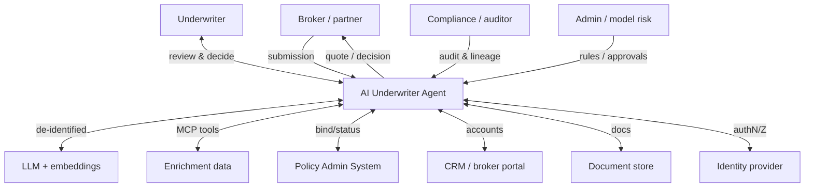

# 0. Architecture Overview (start here)

**Project:** AI Underwriter Agent
**Document status:** Living overview — the single entry point to the design
**Audience:** Everyone

This ties the full document set together. If you read one page, read this, then jump to the
[Recommended Solution](08-recommended-solution.md) for the committed plan.

---

## 1. What it is

An **AI-first, human-augmenting, multi-line property & casualty (P&C) underwriting agent**. In the
*target state* it ingests a submission, enriches and analyzes it, and recommends `APPROVE` /
`REFER` / `DECLINE` with an indicative price and a cited rationale — fast, consistently, and
auditably. It is line-agnostic by design; **vacant home (Canadian vacant-property) is the first
line built and the worked reference example** (see [doc 9](09-multi-line-architecture.md)). **AI does the work; a
deterministic core keeps the binding-relevant authority; a human owns the bind.** Clean low-risk
files can flow straight through within tight, audited bounds.

> **Status legend** (used across the doc set): **Built** = implemented in code today;
> **Designed / Proposed / Vision** = specified, not yet built.
>
> **Implemented today (Phase 0, vacant home only):** the decision core — deterministic rules
> guardrails + case-based k-NN learning + indicative pricing + an in-memory audit trail + a REST
> API + tests. Enrichment, RAG/cited rationale, the event-driven runtime, persistence, security,
> multi-line modules, and the dashboards are **designed, not built** — see [doc 8 §5](08-recommended-solution.md#5-the-committed-delivery-order)
> for the sequence.

## 2. System context

> Standalone source: [`diagrams/system-context.mermaid`](diagrams/system-context.mermaid).

## 3. Architecture in one picture (the layers)

| Layer | What | Where it's specified |
|-------|------|----------------------|
| **Lines of business** | Pluggable modules (vacant home, rental, contents, farm) on a generic core | [doc 9](09-multi-line-architecture.md) |
| **Agent pipeline** | *Built:* Intake → risk-profiling → pattern-learning (k-NN) → compliance → pricing ([doc 2](02-architecture-design.md)). *Target adds:* enrich, RAG, drafting, evaluator ([doc 7](07-target-architecture.md)) | [doc 2](02-architecture-design.md), [doc 7](07-target-architecture.md) |
| **Decision model** | Deterministic guardrails + numeric k-NN + RAG advisory, most-conservative blend; LLM never binds | [doc 2](02-architecture-design.md), [doc 5](05-ai-learning-design.md), [doc 6](06-rag-design.md) |
| **AI integration** | Spring AI; offline floor + Claude; in-process ONNX embeddings; **pgvector** store; MCP tools | [doc 6](06-rag-design.md), [doc 7](07-target-architecture.md) |
| **Runtime** | Hybrid sync/async, event-driven, durable workflow + HITL | [doc 10](10-runtime-audit-observability.md) |
| **Audit & observability** | Immutable lineage, metrics, dashboards | [doc 10](10-runtime-audit-observability.md) |
| **Security & privacy** | OIDC/RBAC+ABAC, PII handling, AI-specific defenses | [doc 11](11-security-privacy.md) |
| **Resilience & DR** | Degrade-to-floor, HA, backups, DR | [doc 12](12-resilience-dr.md) |
| **Governance & model risk** | Change gate, fairness, drift, oversight | [doc 13](13-ai-governance-model-risk.md) |
| **Cost** | Routing, budgets, cost-per-decision | [doc 14](14-cost-governance.md) |
| **Quality** | Test pyramid + AI evals + red-team + shadow mode | [doc 15](15-testing-evaluation-quality.md) |
| **Delivery** | Containers/k8s, CI/CD with gates, IaC, environments | [doc 16](16-deployment-devops.md) |
| **Data & integration** | Data model, lineage, flywheel pipeline, external interfaces | [doc 17](17-data-integration.md) |

## 4. The principles that hold it together

> **This is the canonical statement of the principles.** Other documents elaborate them in
> context but should not restate or reword them — link here instead, to prevent drift.

1. **AI maximizes the work; the decision authority stays deterministic.** ([ADR-0001](adr/0001-rules-decide-llm-explains.md), re-emphasized by [ADR-0006](adr/0006-case-based-learning.md) and [ADR-0008](adr/0008-ai-maximized-architecture.md): rules moved from "decider" to "guardrail with authority" as case-based learning became the primary signal.)
2. **Learn from the book.** Case-based k-NN over historical outcomes drives risk & price. ([ADR-0006](adr/0006-case-based-learning.md))
3. **Rules are guardrails; the LLM only explains/advises.** No AI output clears a knockout. ([ADR-0001](adr/0001-rules-decide-llm-explains.md), [ADR-0007](adr/0007-rag-spring-ai.md))
4. **Recommend, never auto-bind blindly.** Human-in-the-loop; autonomy only within tight, audited bounds.
5. **Degrade to a safe floor.** Capability scales with what's connected; availability never depends on it. ([ADR-0012](adr/0012-resilience-dr.md))
6. **Everything is pluggable behind seams.** Lines, rules, agents, reasoners, tools, data sources.
7. **Trust is engineered, not assumed.** Audit, evals, fairness, observability, governance are first-class.

## 5. Build status & roadmap (snapshot)

- **Built (Phase 0):** the decision core — guardrails + k-NN + pricing + REST API + tests.
- **Built since:** config-driven rules ([ADR-0018](adr/0018-config-driven-rules.md)); **three lines** —
  vacant home, rental, contents — via the LOB plug-in model ([doc 9](09-multi-line-architecture.md));
  **Phase 1** persistence + tamper-evident audit (JPA, H2 dev / Postgres prod) + baseline metrics
  (Actuator/Micrometer) ([ADR-0019](adr/0019-phase1-persistence-metrics.md)); **Phase 1 baseline
  security** — dual-mode authN (HTTP Basic offline / OIDC-JWT in prod), RBAC, underwriting authority
  limits + four-eyes, and PII redaction ([ADR-0024](adr/0024-phase1-baseline-security.md)).
- **Built since (Phase 2):** **RAG grounding** baseline — corpus ingest + retrieval + advisory
  agent + cited rationale, flag-gated `underwriter.rag.enabled`, Spring AI + in-process ONNX
  embeddings + in-memory/pgvector store ([ADR-0007](adr/0007-rag-spring-ai.md)).
- **Built since (Phase 6 slice):** Reviewer agent (LLM "skeptical underwriter") — a coherence /
  rationale-vs-findings contradiction check on the assembled decision, advisory only
  ([ADR-0022](adr/0022-reviewer-agent.md)); and **autonomy-tier routing** (AUTO / ASSISTED /
  SPECIALIST with QA sampling) classifying each decision within configurable bounds
  ([ADR-0025](adr/0025-autonomy-tiers-stp.md)).
- **Built since (Phase 3 lean tier):** event-driven runtime — async case lifecycle with a durable
  state machine, in-process events (after-commit `@Async`), outbox, idempotency and retries→
  dead-letter; `202 Accepted` + poll API, sync `/submissions` fast-path retained
  ([ADR-0010](adr/0010-event-driven-runtime.md); Kafka/Temporal deferred).
- **Built since (Phase 4):** MCP **enrichment** — peril/crime scores via an `EnrichmentProvider`
  tool boundary (offline-first; MCP servers plug in behind it), cached and degrade-to-floor, adding
  advisory peril findings ([ADR-0026](adr/0026-mcp-enrichment.md)).
- **Built since (Phase 7 baseline):** dashboards + flywheel — realized-outcome capture
  (`OutcomeRecorded`), KPI columns on decisions, an embedded UW performance dashboard
  (`GET /dashboard`) and business Micrometer metrics ([ADR-0027](adr/0027-dashboards-flywheel.md)).
- **Built since (Phase 5):** semantic feature extraction — `UnstructuredDataAgent` extracts bounded
  features from a submission's `notes` (LLM or offline heuristic), advisory-first
  ([ADR-0021](adr/0021-semantic-feature-extraction.md)); and **drafting** — quote/conditions/broker-
  email/UW-memo via `GET /decisions/{ref}/drafts` ([ADR-0028](adr/0028-phase5-intake-drafting.md));
  multimodal/vision intake deferred.
- **Built since (ADR-0020):** hybrid predictive model — a trained `RiskModel` (offline logistic
  stand-in; GBM/XGBoost pluggable behind the seam) predicts claim probability, blended with k-NN
  (k-NN still supplies the comparable cases).
- **Built since (ADR-0023):** k-NN scalability — a `CandidateRetriever` seam (brute-force default;
  offline LSH ANN with exact weighted-Gower re-rank; pgvector/HNSW in prod), config
  `underwriter.similarity.index`.
- **Designed / next:**
  enrichment → intake/drafting → evaluator/autonomy → dashboards/flywheel → hardening, per
  [doc 8 §5](08-recommended-solution.md), with the cross-cutting disciplines (security, resilience,
  governance, cost) threaded through.

## 6. Reading guide by role

- **Executive / product:** docs 0, 8, 7, 1.
- **Architect / lead engineer:** docs 2, 7, 9, 10, 16, 17 + the ADRs.
- **Data / ML:** docs 5, 6, 13, 15.
- **SRE / platform:** docs 10, 12, 16.
- **Security / compliance:** docs 11, 13, 10.
- **Finance / FinOps:** doc 14.

## 7. Document map

`0` overview · `1` BRD · `2` HLD · `3` API · `4` runbook · `5` learning · `6` RAG · `7` target ·
`8` **recommended solution** · `9` multi-line · `10` runtime/audit · `11` security/PII ·
`12` resilience/DR · `13` governance/model-risk · `14` cost · `15` testing/eval ·
`16` deployment/DevOps · `17` data/integration · plus [ADRs 0001–0028](adr/) (0023 built) and
[diagrams](diagrams/).
