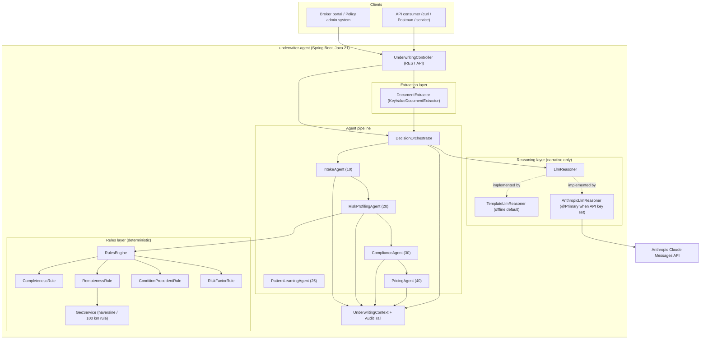
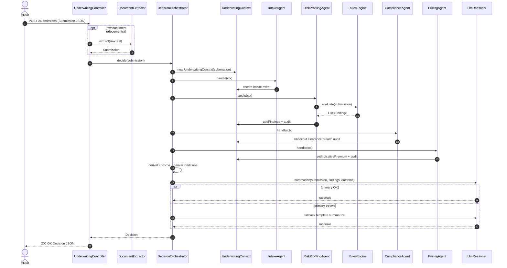
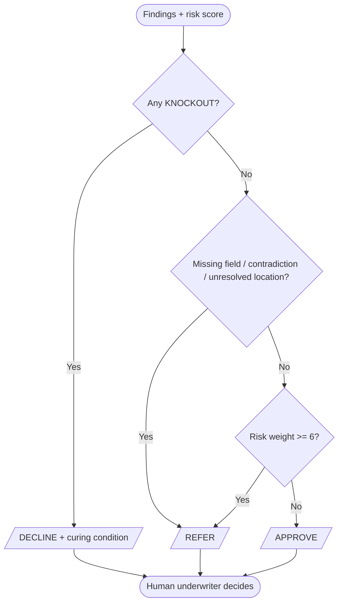
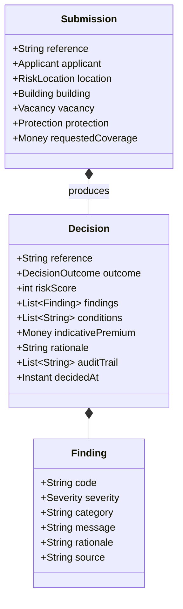

# 2. Architecture & Design (High-Level Design)

**Project:** AI Underwriter Agent
**Document status:** Baseline v1.0
**Audience:** Engineers, architects

---

## 1. Overview

The AI Underwriter Agent is an **AI-first**, multi-line **property & casualty (P&C)
underwriting** decision-support agent built on Spring Boot (Java 21). It risk-assesses insurance
submissions across lines of business and recommends `APPROVE` / `REFER` / `DECLINE` with an
indicative price and a cited, auditable rationale for a human underwriter.

**Vacant home (Canadian vacant-property) is the first line built and the worked reference
example** — the agent is line-agnostic by design (see the Line-of-Business plug-in model in §5).

The defining design principles:

> **The agent learns from the book; deterministic rules are guardrails; the LLM only explains.**

The primary risk signal is **case-based learning** over the historical book: for each
submission the agent retrieves the most similar past policies, reads how they actually
performed, and folds in area-level theft/claim signals (see [doc 5](05-ai-learning-design.md)
and [ADR-0006](adr/0006-case-based-learning.md)). A deterministic, unit-tested **rules engine**
remains as *guardrails* — completeness checks, contradiction detection, geographic eligibility
screens, and condition-precedent knockouts (in the vacant-home line, the decisive 72-hour
inspection knockout) — which no learned signal can override
([ADR-0001](adr/0001-rules-decide-llm-explains.md)). A large language model turns the structured
evidence into a fluent rationale grounded in the comparable cases — it never makes or overrides
a decision.

## 2. Design goals & quality attributes

| Attribute | How the design delivers it |
|-----------|----------------------------|
| Determinism | Rules are pure functions of the `Submission`; the score is a sum of finding weights. |
| Explainability | Every `Finding` has a code, severity, message, rationale and source. |
| Auditability | An `AuditTrail` records every agent action in order; it is part of the `Decision`. |
| Extensibility | Rules, agents, extractors and reasoners sit behind interfaces and are discovered by Spring. |
| Resilience | LLM failures degrade gracefully to the offline reasoner. |
| Safety | Recommend-only; knockouts always surfaced; missing/contradictory data forces referral. |

## 3. Architecture

### 3.1 Container / component view

> Standalone source: [`diagrams/architecture.mermaid`](diagrams/architecture.mermaid).

### 3.2 Layers

| Layer | Package | Responsibility |
|-------|---------|----------------|
| API | `api` | REST surface; maps HTTP to the orchestrator/extractor. |
| Extraction | `extraction` | Turn raw documents into a normalized `Submission`. |
| Agent pipeline | `agent` | Specialist agents + orchestrator; the workflow. |
| Learning | `history`, `history.model` | The AI-first core: historical book, similarity engine, area risk, learned assessment. |
| Rules | `rules`, `rules.impl` | Deterministic underwriting guardrails. |
| Geo | `geo` | Remoteness math (haversine, 100 km rule). |
| Reasoning | `llm` | Narrative generation behind a swappable interface. |
| Domain | `domain.model`, `domain.decision`, `domain.audit` | Immutable records: inputs, outputs, audit. |

## 4. The multi-agent pipeline

The pipeline mirrors the agentic-underwriting pattern (intake → risk profiling → compliance
→ pricing → orchestrated decision). Each agent implements `UnderwritingAgent`, declares an
`order()`, and enriches a shared `UnderwritingContext`.

> Standalone source: [`diagrams/pipeline-sequence.mermaid`](diagrams/pipeline-sequence.mermaid).

### 4.1 Agent responsibilities

| Order | Agent | Responsibility | Side effects on context |
|-------|-------|----------------|--------------------------|
| 10 | `IntakeAgent` | Acknowledge & log the submission (extraction seam upstream). | Audit entry. |
| 20 | `RiskProfilingAgent` | Run the `RulesEngine` (guardrails) over the submission. | Adds rule findings; audit entry. |
| 25 | `PatternLearningAgent` | **AI-first core** — learn from comparable history (claim prob, loss ratio, peril, area theft). | Sets `LearnedAssessment`; adds learned findings; audit entry. |
| 30 | `ComplianceAgent` | Inspect findings for condition-precedent knockouts. | Compliance clearance/breach audit entry. |
| 40 | `PricingAgent` | Price from the comparable fair rate × area load (cold-start: base + risk load). | Sets premium; audit entry. |
| — | `DecisionOrchestrator` | Run agents in order, blend learned + guardrail outcomes (most conservative), derive conditions, request the rationale, assemble `Decision`. | Final audit entries. |

The learning layer (`HistoricalPolicyRepository`, `SimilarityEngine`, `AreaRiskService`) and how
it produces the `LearnedAssessment` are detailed in [doc 5 — AI-First Learning Design](05-ai-learning-design.md).

The orchestrator injects the `@Primary` `LlmReasoner` (Anthropic when configured, else the
template) plus the `TemplateLlmReasoner` as an explicit fallback — so list-injection ordering
never silently picks the wrong reasoner. (See [ADR-0003](adr/0003-pluggable-llm-offline-default.md).)

## 5. Rules layer (config-driven)

Rules are **data, not code** ([ADR-0018](adr/0018-config-driven-rules.md)), and are **split by line
of business** under `resources/rules/`: `shared.yml` (all lines) plus one file per line —
`vacant-home.yml`, `rental.yml`, … (rules in a line file are auto-scoped to that line). The set is
read from the classpath by default, or an external directory via `underwriter.rules.dir`. They are
evaluated by the `ConfigurableRulesEngine` against facts produced by the `FactExtractor`:

- **`FactExtractor`** (code) flattens a `Submission` into named facts and computes the few derived
  values rules can't express declaratively — geo remoteness (haversine via `GeoService`),
  `monthsVacant`, `perSqft`, and presence/contradiction flags.
- **`rules/*.yml`** (config) — each rule: `id`, optional `line` (defaults to the file's line),
  `code`, `category`, `severity`, an `all:` list of `{fact, op, value}` conditions, and
  `message`/`rationale` with `{fact}` interpolation. Ops: `eq, ne, gt, gte, lt, lte, eqIgnoreCase,
  isTrue, isFalse, isNull, isNotNull`.
- **`ConfigurableRulesEngine`** runs the rules whose `line` matches the submission (or are shared)
  and whose conditions all hold, emitting `Finding`s.

Changing a threshold/severity/message or adding a simple rule is a **config edit, no code change**.
A genuinely new derived fact or operator is the only thing that needs (small) code.

| Group (config rules) | Sample findings (code → severity) |
|----------------------|-----------------------------------|
| Completeness & integrity (shared) | `MISSING_FIELD` → MEDIUM; `DATA_CONTRADICTION` → HIGH |
| Coverage adequacy (shared) | `POSSIBLE_UNDERINSURANCE` → MEDIUM; `COVERAGE_HIGH_VS_AREA` → LOW |
| Remoteness — 100 km (shared) | `REMOTE_LOCATION` → HIGH; `LOCATION_WITHIN_RANGE` → INFO; `LOCATION_UNRESOLVED` → MEDIUM |
| Fire protection (shared) | `FAR_FROM_HYDRANT` → MEDIUM; `SPRINKLERED` → INFO (mitigant) |
| Moral hazard (shared) | `PRIOR_LOSSES` → HIGH |
| Compliance knockouts (`VACANT_HOME`) | `INSPECTION_INTERVAL_BREACH` → **KNOCKOUT**; `WATER_NOT_SHUT_OFF` → HIGH |
| Risk factors (`VACANT_HOME`) | `LONG_VACANCY`/`DEMOLITION_PLANNED` → HIGH; `OLD_ROOF`/`NO_SECURITY`/`FAR_FROM_FIRE_HALL`/`MODERATE_VACANCY` → MEDIUM; `NO_MONITORED_ALARM`/`RENOVATION_PLANNED` → LOW |
| Rental / landlord (`RENTAL`) | `STR_WITHOUT_ENDORSEMENT` → **KNOCKOUT**; `MISSING_LIABILITY_LIMIT`/`LOW_LIABILITY_LIMIT`/`NO_TENANT_SCREENING` → MEDIUM; `SHORT_TERM_RENTAL` → LOW |
| Contents / personal belongings (`CONTENTS`) | `HIGH_VALUE_ITEMS_UNSCHEDULED` → HIGH; `MISSING_FIELD` (contents value)/`CONTENTS_NO_SECURITY` → MEDIUM; `CONTENTS_ACV_BASIS` → LOW |

A shared rule may restrict itself to specific lines with `lines: [VACANT_HOME, RENTAL]` (used for
property-only rules like `missing-building` and coverage-per-sqft, which don't apply to contents).
A line file's rules default to that line; `shared.yml` rules default to all lines.

**Line-of-business routing:** the rule's `line:` field scopes it (omit = shared/all-lines). Adding a
new line is adding rules that declare their line — no engine change. This is the config form of the
LOB plug-in model ([doc 9](09-multi-line-architecture.md)).

### 5.1 Severity → risk weight

| Severity | Weight | Meaning |
|----------|--------|---------|
| INFO | 0 | Neutral / mitigating context |
| LOW | 1 | Mild negative |
| MEDIUM | 3 | Material factor |
| HIGH | 6 | Strong risk-increasing factor |
| KNOCKOUT | 100 | Condition-precedent breach — forces `DECLINE` |

The **risk score** is the sum of finding weights. Knockout weight (100) is excluded from the
pricing load so it doesn't distort the indicative premium.

### 5.2 Geographic eligibility screen — the 100 km rule (GeoService)

The generic core owns a **geographic eligibility / remoteness screen**; the 100 km rule is the
vacant-home module's instance of it. `GeoService` computes great-circle (haversine) distance
from the property to a built-in table of major Canadian cities. A property is flagged **remote
only if it is >100 km from every city** — genuinely remote, not just far from one. If
coordinates are absent it falls back to a province centroid; if neither resolves, it returns
"unresolved" so the rule refers the file for manual geo review rather than passing it silently.

## 6. Decision policy

> Standalone source: [`diagrams/decision-flow.mermaid`](diagrams/decision-flow.mermaid).

The orchestrator derives **two** outcomes and takes the **most conservative**:

- **Guardrail outcome** (rules): `DECLINE` on any knockout; `REFER` when data is
  missing/contradictory, the location is unresolved, or rule risk weight ≥ `REFER_THRESHOLD` (6);
  else `APPROVE`.
- **Learned outcome** (data): `DECLINE` when comparable claim probability ≥ 0.70 or expected
  loss ratio ≥ 1.5; `REFER` when claim probability ≥ 0.55 or loss ratio ≥ 1.0; else `APPROVE`.

So a clean file with poor comparables can still be referred/declined, and a file with great
comparables is still declined on a hard knockout — neither layer can silently override the
other's escalation. A knockout always carries its curing condition, so the underwriter can
convert a decline to a conditional bind. On a **cold-start** book the learned layer is neutral
and guardrails decide. The diagram above shows the guardrail half; the full blend and the
learned thresholds are in [doc 5 §6](05-ai-learning-design.md#6-how-learning-drives-the-decision-and-price).

`REFER_THRESHOLD`, the learned thresholds, and the similarity feature weights are documented
constants encoding underwriting appetite; they must be reviewed/back-tested by UW & actuarial
before production use.

## 7. Domain model

Immutable Java records; Jackson serializes them to/from JSON. Nullable fields are intentional
— missing data is a signal the completeness rule detects, not something defaulted away.

> Full attribute-level diagram: [`diagrams/domain-model.mermaid`](diagrams/domain-model.mermaid).

## 8. Cross-cutting concerns

- **Audit trail** — `AuditTrail` is an append-only, ordered log threaded through the context;
  every agent records what it did and why. Emitted on every `Decision`.
- **Error handling** — extraction never invents data; the LLM layer throws `LlmReasoningException`
  which the orchestrator catches and falls back from. Decisions never fail due to the LLM.
- **Configuration** — `application.yml`; the Anthropic key is supplied via environment only.
- **Logging** — SLF4J; per-agent audit + orchestrator outcome and reasoner provider.

## 9. Security & compliance

| Concern | v1.0 stance |
|---------|-------------|
| Secrets | API key via env var only; never in code or committed config. |
| PII | No persistence in v1.0; submissions processed in-memory per request. |
| Outbound calls | Only to the Anthropic API, only when a key is configured. |
| Decisioning control | Recommend-only; deterministic, reviewable rules; full audit trail. |
| Data residency | When Claude is enabled, rationale generation sends finding text to Anthropic — review against data-handling policy before enabling in production. |

## 10. Glossary

| Term | Meaning |
|------|---------|
| **Knockout** | A finding so severe it forces `DECLINE` regardless of the rest of the file. |
| **Condition precedent** | A policy condition that must be met for cover to respond; breach makes a loss deniable. |
| **72-hour inspection** | The vacant-home line's condition-precedent knockout (PR0003 cl.2 + Supervisory Warranty 300130): inspect a vacant property at least every 72 hours. |
| **PR0003 / 300130** | The Unoccupancy Conditions and Supervisory Warranty policy forms (vacant-home line). |
| **Geographic eligibility / remoteness (100 km rule)** | The generic remoteness screen; in the vacant-home line, flag a property only if it is >100 km from *every* major Canadian city. |
| **Refer** | Send to a human underwriter for a decision rather than approving/declining automatically. |
| **MGA** | Managing General Agent — underwrites on behalf of an insurer. |
| **PAS** | Policy Administration System (where binding/issuance happens). |
| **Case-based reasoning (k-NN)** | Predicting a new risk from the outcomes of the most similar past policies. |
| **Loss ratio** | Incurred claims ÷ premium; a proxy for whether a policy was profitable. |
| **Cold start** | Too little history to learn from; the agent falls back to guardrails + base rate. |
| **Area risk** | Per-area claim/theft statistics learned from the book, used as a pricing load. |
| **Gower distance** | A mixed-type distance combining normalized numeric and matched categorical features. |

## 11. Technology choices

Java 21, Spring Boot 3.3.x (web + validation + test), JDK `HttpClient` for the optional
Anthropic call (no extra HTTP dependency), Jackson for JSON, JUnit 5 + AssertJ for tests.
Rationale in [ADR-0005](adr/0005-java-spring-boot.md).

## 12. Evolution path

> The full north-star design — AI across the whole lifecycle (MCP enrichment, multimodal intake,
> orchestrator + evaluator, autonomy tiers/STP, AI-ops platform, data flywheel) — is in
> [doc 7 — Target-State Architecture](07-target-architecture.md) and [ADR-0008](adr/0008-ai-maximized-architecture.md).
> The near-term steps:

- **Real data** — swap the synthetic generator in `HistoricalPolicyRepository` for a reader over
  real policy + claims data (CSV/JDBC/warehouse); everything downstream is source-agnostic.
- **Indexing at scale** — ✅ built behind a `CandidateRetriever` seam (brute-force default; an offline
  LSH ANN with an exact weighted-Gower re-rank; pgvector/HNSW in prod), selected by
  `underwriter.similarity.index` ([ADR-0023](adr/0023-knn-scalability-ann.md)).
- **Trained model (hybrid)** — add a gradient-boosted claim-probability/loss-ratio model as a
  complementary signal behind the assessment seam — **GBM predicts, k-NN still explains** (retains
  the comparable cases) ([ADR-0020](adr/0020-hybrid-predictive-model.md), [ADR-0006](adr/0006-case-based-learning.md)).
- **Semantic feature extraction** — an early `UnstructuredDataAgent` uses an LLM to extract a
  bounded, schema-constrained set of risk features from inspection reports, broker emails and photos,
  feeding the predictive model (decision stays deterministic) ([ADR-0021](adr/0021-semantic-feature-extraction.md)).
- **Reviewer agent** — a final LLM "skeptical underwriter" checks the assembled decision for
  rationale-vs-findings contradictions and groundedness; it flags and routes to a human, never
  decides ([ADR-0022](adr/0022-reviewer-agent.md)).
- **RAG grounding** — a retrieval-augmented layer (Spring AI) that grounds reasoning in policy
  wordings/guidelines and semantic precedent, producing an advisory finding + cited rationale
  while guardrails retain authority. *Proposed* — see [doc 6](06-rag-design.md) and [ADR-0007](adr/0007-rag-spring-ai.md).
- **Feedback loop** — capture underwriter overrides and realized outcomes to back-test and tune
  thresholds and feature weights.
- **Persistence & workbench** — store decisions + audit trails; add a UI that surfaces the
  comparable cases and area evidence (see BRD future scope).
