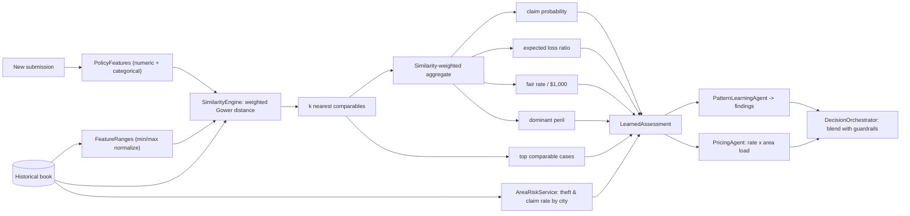

# 5. AI-First Learning Design (Case-Based Reasoning)

**Project:** AI Underwriter Agent
**Document status:** Baseline v1.0
**Audience:** Engineers, data, underwriting

---

## 1. Intent

The agent is **AI-first**, a multi-line **property & casualty (P&C) underwriting** decision-support
agent: it learns from the book of business. For a new submission it finds
the most similar past policies, looks at how they actually performed (claims, loss ratios,
perils), folds in area-level theft/claim signals, and lets that evidence drive the risk view
and the price. Deterministic rules remain only as **guardrails** (knockouts, completeness). See
[ADR-0006](adr/0006-case-based-learning.md).

> The case-based learning described here is line-agnostic core machinery. **Vacant home
> (Canadian vacant-property) is the first line built and the worked reference example** — the
> agent is line-agnostic by design (see the [Line-of-Business plug-in model](09-multi-line-architecture.md)).
> The feature weights, perils and area signals below are illustrated with the vacant-home line; each
> line of business supplies its own feature schema and rule pack.

> Why case-based (k-NN) and not a trained model first: it is transparent and explainable out of
> the box (we can show the underwriter the exact comparable files), needs no training pipeline,
> and upgrades automatically as the book grows. A trained model can be added later behind the
> same seam (§7).

## 2. The learning flow

> Standalone source: [`diagrams/learning-flow.mermaid`](diagrams/learning-flow.mermaid).

## 3. Components

| Component | Responsibility |
|-----------|----------------|
| `HistoricalPolicyRepository` | Holds the book; precomputes `FeatureRanges`. Synthetic today, real source in production. |
| `SyntheticHistoryGenerator` | Deterministically generates a realistic book with learnable patterns. |
| `PolicyFeatures` | Uniform feature view extracted from either a `Submission` or a `HistoricalPolicy`. |
| `FeatureRanges` | Per-feature min/max; normalizes numerics to [0,1] for distance. |
| `SimilarityEngine` | k-NN retrieval + similarity-weighted aggregation → `LearnedAssessment`. |
| `AreaRiskService` | Per-area claim/theft statistics and the area pricing load. |
| `PatternLearningAgent` | Turns the `LearnedAssessment` into findings on the context. |
| `LearnedAssessment` | The output: claim probability, loss ratio, fair rate, peril, comparables, area risk, confidence. |

## 4. Similarity model

A **weighted Gower distance** in [0,1] combines:

- **Numeric features** — normalized to [0,1] by `FeatureRanges`, contributing the absolute
  difference per feature. Weights emphasize risk-driving features:

  | feature | weight | | feature | weight |
  |---------|:------:|-|---------|:------:|
  | roofAgeYears | 1.5 | | inspectionIntervalHours | 1.0 |
  | vacancyMonths | 1.5 | | distanceToFireHallKm | 1.0 |
  | priorLossCount | 1.0 | | securitySystem | 1.0 |
  | coverageAmount | 0.8 | | units / squareFeet / yearBuilt | 0.5 |
  | monitoredAlarm | 0.5 | | | |

- **Categorical features** — 0 if equal, 1 if different. Weights: `city` 2.0 (location matters
  most), `province` 1.0, `construction` 0.5, `occupancyType` 0.3.

`similarity = 1 − distance`. The top `k` (default 25, `underwriter.similarity.k`) are retained.

## 5. Aggregation → prediction

Across the `k` comparables, similarity-weighted:

- **claimProbability** = Σ(simᵢ · claimedᵢ) / Σ simᵢ
- **expectedLossRatio** = Σ(simᵢ · lossRatioᵢ) / Σ simᵢ
- **suggestedRatePerThousand** = Σ(simᵢ · rateᵢ) / Σ simᵢ
- **dominantPeril** = similarity-weighted modal peril among the claimants
- **confidence** = `LOW`/`MEDIUM`/`HIGH` from `k` and mean similarity
- **topComparables** = the closest 8, shown to the underwriter as evidence

If the book has fewer than 5 policies the result is **cold-start**: the agent falls back to
the guardrail rules and a base-rate price.

## 6. How learning drives the decision and price

**Decision** — `DecisionOrchestrator` derives two outcomes and takes the **most conservative**:

| Layer | DECLINE when | REFER when |
|-------|--------------|------------|
| Guardrails (rules) | any condition-precedent knockout (e.g. the vacant-home module's inspection > 72h rule) | missing/contradictory data, unresolved location, or rule risk weight ≥ 6 |
| Learned (data) | claim prob ≥ 0.70 or loss ratio ≥ 1.5 | claim prob ≥ 0.55 or loss ratio ≥ 1.0 |

> These thresholds (and `REFER_THRESHOLD = 6`) are **illustrative defaults on the synthetic book —
> not calibrated against real loss experience**. They encode underwriting appetite and must be
> reviewed/back-tested by UW & actuarial before production use ([doc 13](13-ai-governance-model-risk.md)).

So a clean file with bad comparables can still be referred/declined; a file with great
comparables is still declined on a hard knockout. Neither layer can silently override the
other’s escalation.

**Price** — `PricingAgent` uses the comparable fair rate × area theft load:
`premium = (coverage / 1000) × suggestedRatePerThousand × areaTheftLoad`, floored at the
minimum. Cold-start falls back to base rate + rule-derived risk load.

## 7. The synthetic book (and replacing it)

`SyntheticHistoryGenerator` is deterministic for a seed and embeds **learnable patterns** so the
agent has something real to learn. The book is partitioned by line of business; the patterns below
illustrate the vacant-home line:

- Each city carries a theft bias and a base claim bias (e.g. Flin Flon/Winnipeg high, Halifax
  low), so areas genuinely differ.
- Claim probability rises with vacancy duration, roof age, missing security, long inspection
  intervals, prior losses, and fire-hall distance.
- Claim peril is driven by the matching feature (theft ↔ no security + city theft bias; water ↔
  old roof; fire ↔ far fire hall; vandalism ↔ long vacancy).
- Premium charged tracks technical risk, so the fair rate is itself learnable.

Configuration: `underwriter.history.size` (default 1500), `underwriter.history.seed` (default
42), `underwriter.similarity.k` (default 25).

**To go production-grade:** replace the generation in `HistoricalPolicyRepository` with a reader
over real policy + claims data (CSV/JDBC/warehouse) that yields `HistoricalPolicy` records.
Everything downstream — similarity, area stats, pricing, decisioning — is source-agnostic.

**Hybrid prediction (built — offline baseline):** a trained `RiskModel` behind the assessment seam
predicts claim probability, blended with the k-NN signal (default **max** = most conservative) while
k-NN is always run to retrieve the comparable cases shown as evidence — **prediction separated from
explanation**. The default `LogisticRiskModel` is an offline, dependency-free logistic regression
trained on the book at startup; a gradient-boosting model (XGBoost/LightGBM) — which learns feature
importance and non-linear interactions the fixed Gower weights cannot — plugs in behind the same
seam. See [ADR-0020](adr/0020-hybrid-predictive-model.md) (and HLD §12, ADR-0006 alternatives).

**Future — semantic features:** an early `UnstructuredDataAgent` uses an LLM to extract a bounded,
schema-constrained set of risk features (e.g. `deferredMaintenancePresent`) from inspection reports,
broker emails and photos, which then feed these same models — see [ADR-0021](adr/0021-semantic-feature-extraction.md).

**Scale (built):** the per-request linear scan in §4 sits behind a `CandidateRetriever` seam —
brute-force by default, or an approximate-nearest-neighbour index (offline LSH; pgvector/HNSW in
prod) with an exact weighted-Gower re-rank on the candidate set — selected by
`underwriter.similarity.index`. See [ADR-0023](adr/0023-knn-scalability-ann.md).

## 8. Explainability & governance

Every decision ships a `LearnedAssessment` containing the comparable policy ids, their
similarity and outcomes, the area statistics, and the confidence label — so an underwriter (or
auditor) can see exactly which past files and area evidence drove the recommendation. Feature
weights and learned thresholds are documented constants that must be reviewed and back-tested by
underwriting/actuarial before production use.
