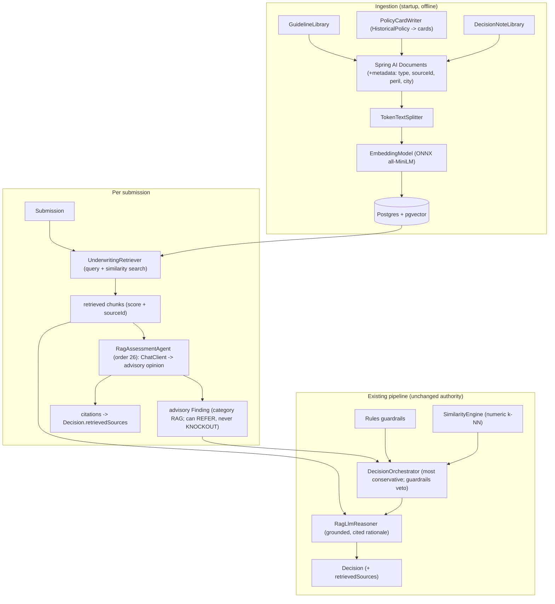

# 6. RAG Pipeline Design (Spring AI)

**Project:** AI Underwriter Agent
**Document status:** Proposed (design-first; build to follow)
**Audience:** Engineers, data, underwriting
**Related:** [ADR-0007](adr/0007-rag-spring-ai.md), [doc 5 — AI-First Learning](05-ai-learning-design.md), [HLD](02-architecture-design.md)

---

## 1. Intent

Add a **Retrieval-Augmented Generation (RAG)** layer so the agent can ground its reasoning in
the things case-based k-NN can't see: **unstructured knowledge** — policy wordings, underwriting
guidelines, and precedent notes — plus **semantic** precedent across historical policies. The
LLM, given retrieved evidence, produces an **advisory** risk opinion and a **citeable**
rationale.

This is deliberately **Option B** (advisory): RAG augments, it does not take over.

> The RAG layer is generic, multi-line **P&C** core machinery; the corpus and examples below are
> drawn from the **vacant home (Canadian vacant-property)** line, the first line built and the
> worked reference example. Each line of business tags its own wordings/guidelines (see the
> [Line-of-Business plug-in model](09-multi-line-architecture.md)).

- The deterministic **rules guardrails** still own the condition-precedent knockouts (e.g. the
  vacant-home module's 72-hour inspection condition precedent) — RAG can never override them.
- The structured **`SimilarityEngine` (numeric k-NN)** still produces the claim-probability /
  loss-ratio / fair-rate signal.
- RAG adds an **advisory finding** (capped severity — it can push to `REFER`, never `KNOCKOUT`)
  and a **source-cited rationale**.

Why RAG *and* k-NN, not RAG instead of k-NN: k-NN is precise on **structured numeric** similarity
and is deterministic; RAG is best on **unstructured/semantic** content and natural-language
precedent. They are complementary (see [ADR-0006](adr/0006-case-based-learning.md) and ADR-0007).

## 2. Decisions (locked)

| Decision | Choice | Rationale |
|----------|--------|-----------|
| Library | **Spring AI** | Native to our Spring Boot app: `ChatClient`, `VectorStore`, `EmbeddingModel`, RAG advisors, auto-config. |
| LLM role | **Advisory + guardrails veto** | Preserves determinism/auditability; LLM never decides. |
| Corpus | Wordings/guidelines + policy cards + decision notes | The three highest-value grounding sources. |
| Embeddings | **In-process ONNX (all-MiniLM)** | Offline, no key, private, sufficient quality. |
| Vector store | **`pgvector`** (Postgres extension) | Persistent and scalable; one Postgres serves both vectors and relational data. Requires a running Postgres (lands with the Phase 1 persistence work). In-memory `SimpleVectorStore` remains available as a dev/test fallback only. |
| Generation | Anthropic Claude (optional) | Reuses our existing offline-by-default LLM seam. |

## 3. Architecture



> Standalone source: [`diagrams/rag-pipeline.mermaid`](diagrams/rag-pipeline.mermaid).

## 4. New components

New package `com.iqspark.underwriter.rag`:

| Component | Type | Responsibility |
|-----------|------|----------------|
| `corpus/GuidelineLibrary` | `@Component` | Supplies synthetic-but-realistic policy wordings & UW guideline documents (PR0003, Supervisory Warranty 300130, CGL, endorsements, manual). |
| `corpus/PolicyCardWriter` | `@Component` | Serializes each `HistoricalPolicy` + outcome into a narrative "card" document. |
| `corpus/DecisionNoteLibrary` | `@Component` | Supplies synthetic precedent underwriter notes. |
| `KnowledgeIngestionService` | `@Service` | Startup ETL: assemble `Document`s (+metadata) → `TokenTextSplitter` → `EmbeddingModel` → `VectorStore`. |
| `UnderwritingRetriever` | `@Service` | Build a query from a `Submission`; similarity search (optionally filtered by `type`); return ranked chunks with score + `sourceId`. |
| `RagAssessmentAgent` | `@Component` (`UnderwritingAgent`, order 26) | Retrieve, prompt `ChatClient` for a structured advisory opinion, add an advisory `Finding` + citations to the context. |
| `RagLlmReasoner` | `@Component` `implements LlmReasoner` (`@Primary` when RAG enabled) | Write the rationale grounded in retrieved sources, with `[sourceId]` citations; fall back to template reasoner on error/disabled. |
| `RetrievedSource` | record | `{sourceId, type, score, snippet}` — carried on the `Decision` for transparency. |

### Spring AI pieces used

`Document`, `TokenTextSplitter`, `EmbeddingModel` (from `spring-ai-transformers`, in-process
ONNX), `VectorStore` backed by **pgvector** (`spring-ai-starter-vector-store-pgvector`),
`ChatClient` (+ `spring-ai-starter-model-anthropic`), and `SearchRequest` for filtered similarity
queries (pgvector supports metadata filtering on `type`/`lob`). RAG advisors (`QuestionAnswerAdvisor` /
`RetrievalAugmentationAdvisor`) are an option for the rationale, but we use an explicit
retriever + prompt so we control citations and the advisory contract.

## 5. Data model & metadata

Each `Document` carries metadata for filtering and citation:

| key | values | use |
|-----|--------|-----|
| `type` | `GUIDELINE`, `WORDING`, `POLICY_CARD`, `DECISION_NOTE` | filter retrieval; label citations |
| `sourceId` | e.g. `PR0003-cl2`, `HP-00231`, `NOTE-0042` | stable citation handle |
| `peril` | `THEFT`, `WATER`, … (cards/notes) | optional relevance boost |
| `city` | risk city (cards/notes) | optional locality filter |

Example query the retriever builds from a submission:

> "Vacant frame detached home in Winnipeg, vacant 14 months, no security system, inspection
> every 96 hours, roof age 22, coverage 450,000. Relevant unoccupancy conditions, theft
> precedent, and comparable outcomes."

## 6. Processing sequence

1. **Startup** — `KnowledgeIngestionService` ingests all three corpora into the vector store
   (offline embeddings). Logs the indexed chunk count.
2. **Per submission** — after `PatternLearningAgent` (order 25), the `RagAssessmentAgent`
   (order 26):
   a. builds a query from the submission and retrieves top-k chunks per type (e.g. 4 guidelines,
      4 cards, 2 notes), each with a score and `sourceId`;
   b. calls `ChatClient` with a tight prompt: *"Using only the retrieved context, give a risk
      lean (lower/elevated/higher), the specific conditions/wordings that apply, and cite source
      ids. Do not invent facts."*;
   c. adds an advisory `Finding` (category `RAG`, severity capped at `MEDIUM`/`HIGH`) and stores
      the retrieved sources on the context.
3. **Decision** — `DecisionOrchestrator` blends as today (most conservative of guardrail +
   learned), with the RAG finding contributing to the risk weight but unable to force a
   knockout. `RagLlmReasoner` writes the cited rationale.
4. **Output** — `Decision` gains `retrievedSources` so the underwriter sees exactly which
   clauses/cases were used.

## 7. Guardrails on the LLM (safety)

- **Advisory only** — RAG findings have capped severity; they can move an outcome to `REFER`
  but never produce a `KNOCKOUT`. Hard compliance stays with the rules.
- **Grounded** — the prompt instructs "use only retrieved context; cite source ids; if unsure,
  say so". Low-score retrievals (below a `minScore`) are dropped.
- **Degrades safely** — if RAG is disabled, the store is empty, or the LLM call fails, the agent
  emits no finding and the pipeline behaves exactly as the current k-NN + guardrails design
  (the `LlmReasoner` falls back to the offline template).
- **Auditable** — retrieved `sourceId`s and scores are recorded in the audit trail and the
  `Decision`.

## 8. Configuration

```yaml
underwriter:
  rag:
    enabled: true            # master switch; false => behaves exactly like the pre-RAG pipeline
    retrieval:
      topK: 4                # per type
      minScore: 0.6          # drop weak matches
    advisory:
      maxSeverity: MEDIUM    # cap on the RAG finding's weight
spring:
  datasource:                # pgvector lives in Postgres
    url: ${DB_URL:jdbc:postgresql://localhost:5432/underwriter}
    username: ${DB_USER:underwriter}
    password: ${DB_PASSWORD:}
  ai:
    # in-process ONNX embedding model (offline); model fetched & cached on first run
    embedding:
      transformer:
        onnx:
          modelUri: <all-MiniLM-L6-v2 onnx>
    vectorstore:
      pgvector:
        initialize-schema: true   # create the vector table + extension if absent
        dimensions: 384           # all-MiniLM-L6-v2 embedding size
        index-type: HNSW          # ANN index for fast similarity search
    anthropic:
      api-key: ${UNDERWRITER_LLM_ANTHROPIC_API_KEY:}   # optional; offline template used if unset
```

## 9. Dependencies (to add)

- `spring-ai-bom` (import scope) — pins the Spring AI module versions.
- `spring-ai-starter-model-anthropic` — `ChatClient` generation (optional, key-gated).
- `spring-ai-transformers` — in-process ONNX `EmbeddingModel`.
- `spring-ai-starter-vector-store-pgvector` — the **pgvector**-backed `VectorStore`.
- `spring-boot-starter-jdbc` + the PostgreSQL driver, and a Postgres with the `vector` extension
  (shared with the Phase 1 persistence work). `SimpleVectorStore` (core) remains available behind a
  profile as a dev/test fallback that needs no Postgres.

> Exact versions are pinned against the current Spring AI BOM at build time. Spring AI's API
> surface shifted across its 1.0/2.0 line, so the wiring is verified by compiling locally as we
> build (the sandbox here can't run Maven).

## 10. Testing strategy

| Test | Verifies (offline) |
|------|--------------------|
| `KnowledgeIngestionServiceTest` | All corpora ingested; chunk count > 0; metadata present. |
| `UnderwritingRetrieverTest` | A theft-prone Winnipeg submission retrieves theft/unoccupancy chunks above others; `minScore` filtering. |
| `RagAssessmentAgentTest` | With a **stubbed `ChatClient`**, produces an advisory finding (capped severity) + citations; emits nothing when disabled/empty. |
| `RagLlmReasonerTest` | Rationale includes `[sourceId]` citations; falls back to template on error. |
| Pipeline test | RAG finding can move APPROVE→REFER but a knockout still DECLINES; RAG disabled == current behavior. |

Embeddings run in-process (ONNX), so tests need no network (after the model is cached) and no API
key. For the vector store, tests use **Testcontainers (Postgres + pgvector)** for integration, or
the `SimpleVectorStore` dev/test profile for fast unit tests that don't need a database.

## 11. Rollout & evolution

> These are **stages within the RAG workstream** (which is global **Phase 2** in
> [doc 8 §5](08-recommended-solution.md#5-the-committed-delivery-order)) — not global phase numbers.

- **Stage A** — thin slice: guidelines ingest + retrieve + grounded rationale (`enabled` flag),
  on **pgvector** (using the Phase 1 Postgres; `SimpleVectorStore` profile for quick local dev).
- **Stage B** — add policy cards + decision notes + the advisory agent + `retrievedSources`
  (this extends the [doc 3](03-api-specification.md) `Decision` schema with `retrievedSources` —
  a future field, not present today).
- **Stage C (scale)** — tune the pgvector ANN index (HNSW), add re-ranking and retrieval
  evaluation, consider hosted embeddings for quality, and ingest **real** wordings/guidelines and
  the real book.
- **Future** — tool-calling agent (Spring AI tools) for multi-step retrieval; feedback loop on
  which sources underwriters found decisive.

## 12. Risks & mitigations

| Risk | Mitigation |
|------|------------|
| Spring AI version/API drift | Pin via BOM; compile locally as we build; keep RAG behind `enabled` flag. |
| First-run model download needs network | Document it; cache the ONNX model; allow a pre-baked model path. |
| LLM hallucination / ungrounded claims | Advisory-only, `minScore` filter, "cite or abstain" prompt, capped severity, guardrails veto. |
| Retrieval quality on synthetic corpus | Tune `topK`/`minScore`; replace synthetic corpus with real documents in prod. |
| Cost/latency when Claude enabled | RAG/LLM optional; offline template path always available; cache embeddings. |
| Data residency when Claude enabled | Same as today — review against policy before enabling cloud generation. |
