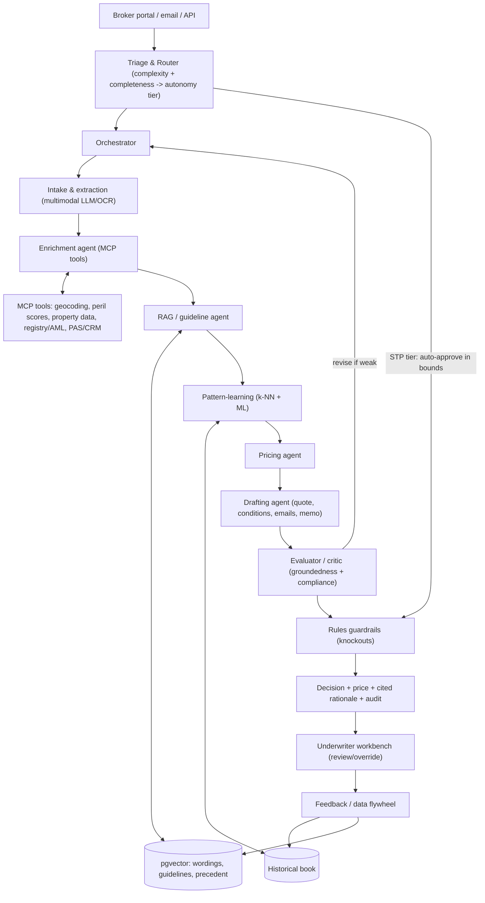

# 7. Target-State Architecture — AI-Maximized, Human-Augmenting Underwriting

**Project:** AI Underwriter Agent
**Document status:** Vision / target architecture (north star for the roadmap)
**Audience:** Engineering leadership, architects, underwriting & ops leadership
**Related:** [HLD](02-architecture-design.md), [Learning](05-ai-learning-design.md), [RAG](06-rag-design.md), [ADR-0008](adr/0008-ai-maximized-architecture.md)

---

## 1. The thesis

Maximize AI across the whole underwriting lifecycle — not just the decision — so that **routine
work disappears and skilled people spend their time only where judgment matters.** This is the
target state for a generic, multi-line **property & casualty (P&C) underwriting** agent (vacant
home is the first line built and the worked reference example; the lifecycle described here is
line-agnostic). The agent *does the legwork* (gather, enrich, retrieve, analyze, draft) and
*prepares the decision*; a human owns the bind. Where files are clean and low-risk, they flow
straight through within tight, auditable bounds.

One principle holds the whole thing together and is the single most important design decision:

> **Maximize AI for the work; keep the binding decision deterministic and auditable.**
> AI does intake, enrichment, retrieval, analysis, drafting, and recommendation. The *authority*
> to clear a compliance knockout or auto-approve stays with deterministic rules and explicit
> autonomy bounds — never with a probabilistic model. This is what lets us be aggressive with AI
> everywhere else without betting the licence on a hallucination.

## 2. What changes vs. today

Today we have a strong **decision core**: deterministic guardrails + case-based learning (k-NN) +
an LLM that explains, with a planned RAG layer. The target state wraps that core in the rest of
the lifecycle and an AI-ops platform:

| Stage | Today | Target |
|-------|-------|--------|
| Intake | Structured JSON / simple text parse | Multimodal LLM extraction from PDFs, emails, attachments → normalized submission, **plus bounded semantic risk features that feed the predictive model** ([ADR-0021](adr/0021-semantic-feature-extraction.md)) |
| Enrichment | None | Agent pulls external data via **MCP tools** (geocoding, flood/wildfire/wind/crime peril scores, property & imagery data, business registry, sanctions/AML) |
| Retrieval | (planned RAG) | RAG over wordings/guidelines/precedent, with citations |
| Analysis | k-NN + rules | k-NN + rules + RAG advisory + a trained **GBM** signal — **GBM predicts, k-NN explains**, behind one assessment seam ([ADR-0020](adr/0020-hybrid-predictive-model.md)); ANN-indexed at scale ([ADR-0023](adr/0023-knn-scalability-ann.md)) |
| Decision | APPROVE/REFER/DECLINE | Same, plus **autonomy tiers** (true straight-through for clean low-risk files) |
| Drafting | None | Agent drafts the quote, conditions, broker email, and underwriter memo for one-click review |
| Human loop | Implicit (recommend-only) | First-class **workbench**: review, edit, override, with every override captured |
| Platform | Logs + audit trail | **Eval harness, agent observability, layered guardrails, governance, data flywheel** |

## 3. Reference architecture

> Standalone source: [`diagrams/target-architecture.mermaid`](diagrams/target-architecture.mermaid).
> Layered guardrails, observability/eval harness and governance are cross-cutting over the whole flow.

## 4. The best design decisions (and why)

> These elaborate the canonical principles in [overview §4](00-architecture-overview.md#4-the-principles-that-hold-it-together)
> — refer there for the authoritative statement; this section adds the *why* and the target-state detail.

### 4.1 Deterministic decision authority, probabilistic everywhere else
AI is maximized for *work* (extraction, enrichment, retrieval, analysis, drafting) and
*recommendation*. The **binding-relevant authority** — clearing a condition-precedent knockout,
or auto-approving — is owned by deterministic rules and explicit autonomy bounds. Rationale: it
is the only way to use AI aggressively while keeping the decision reproducible, explainable and
defensible to a regulator. (Extends [ADR-0001](adr/0001-rules-decide-llm-explains.md).)

### 4.2 Autonomy tiers (true straight-through, safely)
A **router** classifies each submission by complexity, completeness, risk and confidence into a
tier:

| Tier | Criteria | Action |
|------|----------|--------|
| **STP / auto** | Complete, low risk, high model confidence, no knockouts, within size/appetite bounds | Auto-approve (recommend → bind via PAS) with full audit; sampled for QA |
| **Assisted** | Most files | AI prepares everything; underwriter reviews & decides in the workbench |
| **Specialist** | Knockouts, low confidence, large/edge risks, contradictions | Routed to a senior underwriter with the AI work-up and flags |

Maximizes automation on the easy majority while guaranteeing humans see anything ambiguous or
high-stakes. Tier bounds are configuration owned by UW leadership.

### 4.3 MCP as the tool/data boundary
External data and internal systems are exposed to agents through **Model Context Protocol (MCP)**
servers — one standard contract for tool discovery and invocation, cleanly separated from
orchestration. Add a new data source by adding an MCP tool, not by rewiring agents. Enrichment
shared across lines: precise geocoding, flood/wildfire/wind/convective and **crime/theft**
peril scores, property/imagery attributes, business registry, and sanctions/AML screening (each
line declares which enrichments are relevant — these all matter for the vacant-home example).

### 4.4 Orchestrator-workers + evaluator (reflection)
Specialist worker agents run under an orchestrator (parallel where independent). A dedicated
**evaluator/critic agent** checks every AI-produced assessment and rationale for **groundedness**
(claims must trace to retrieved sources or computed signals), policy compliance, and contradiction
before it surfaces — and sends it back for one revision pass if weak. This is the practical
hallucination control. It is formalized as the **`ReviewerAgent`** — an LLM "skeptical underwriter"
that runs last and specifically catches a rationale that downplays or omits a knockout finding;
it flags and routes to a human, never decides ([ADR-0022](adr/0022-reviewer-agent.md)).
(Patterns: orchestrator-workers, evaluator-optimizer, ReAct for tool use.)

### 4.5 Layered guardrails
Controls at four points — user/broker input, tool calls, tool responses, and final output —
catch prompt injection, PII leakage, out-of-appetite actions, and ungrounded claims in flight.
The deterministic compliance knockouts sit *after* all AI, as the final veto.

### 4.6 Model routing & offline fallback
Cheap/fast models for triage and extraction; frontier models for nuanced reasoning and drafting;
in-process models for embeddings. Everything degrades to the offline path (template rationale,
rules + k-NN) when cloud LLMs/tools are unavailable — capability scales with what's connected,
availability never depends on it.

### 4.7 The data flywheel
Every decision, the evidence behind it, the human override, and the eventual **realized outcome**
(claim / no claim, loss) feed back to: grow the k-NN book, enrich the RAG corpus and precedent,
expand the eval golden-set, retune thresholds, and (future) train models. The system measurably
improves with use — the core promise of "AI-first."

## 5. AI-ops platform (what makes it trustworthy)

- **Evaluation harness** — a golden set of historical submissions with known-good outcomes;
  regression-tested on every change. LLM-as-judge scores for faithfulness/groundedness of
  rationales; retrieval precision/recall for RAG; decision-agreement vs. senior underwriters.
- **Observability** — multi-agent trace trees (which agent, which tool, which sources, which
  prompt version), token/cost per step, per-tool latency/error, tool-selection accuracy,
  retrieval-drift and outcome-drift monitors.
- **Governance** — versioned prompts and policies, full lineage from inputs → tools → sources →
  decision, reviewer IDs/timestamps/overrides, and model/threshold change provenance. Regulatory
  readiness is a first-class output, not an afterthought.

## 6. How this makes work easier — by role

- **Underwriter** — opens a file already extracted, enriched with peril/crime/property data,
  scored against comparable history, checked against the wordings, and with a **draft decision +
  cited rationale + draft conditions**. They review and either accept or override in one place,
  spending time on judgment, not data gathering. (Industry reports ~45–60 min of prep collapsing
  to minutes.)
- **Broker** — faster quotes; instant, specific feedback on what's missing instead of days of
  back-and-forth.
- **Operations** — intake/triage/data-entry largely automated; manual touches reserved for
  genuine exceptions.
- **Compliance / audit** — every decision ships its evidence, citations, and audit trail; eval
  and drift reports on demand.
- **Underwriting leadership** — appetite encoded and enforced consistently; portfolio-level
  visibility; tier bounds and thresholds tunable with back-testing.

## 7. Roadmap

> **The roadmap is owned by [doc 8 §5](08-recommended-solution.md#5-the-committed-delivery-order)
> — the single source of truth (nine phases, 0–8).** This document describes the *target state*,
> not the delivery sequence. Note in particular that doc 8 puts the **operational backbone
> (persistence, durable audit, baseline security, metrics) first as Phase 1**, ahead of RAG —
> reflecting the re-sequencing in [doc 10 §7](10-runtime-audit-observability.md). Don't rely on any
> phase numbering stated here; defer to doc 8 §5.

Each phase is independently valuable and slots behind the seams already in the codebase
(`UnderwritingAgent`, `LlmReasoner`, the assessment/`SimilarityEngine` seam, `DocumentExtractor`),
so we never rewrite the core to add a capability.

## 8. Key decisions for the org (to confirm)

These are business/risk calls the architecture is designed to support either way:

1. **Autonomy appetite** — how wide are the STP bounds (premium/coverage size, perils, geographies)
   allowed to auto-approve? Start narrow, widen as eval evidence accumulates.
2. **Build vs. buy enrichment** — license a peril/property data provider (e.g. hazard/geospatial
   vendors) vs. assemble sources; MCP makes either pluggable.
3. **Cloud posture & data residency** — which LLM/embedding/enrichment calls may leave the
   environment; the offline path stays as the floor.
4. **Human-review policy** — sampling rate for QA on auto-approved files; override capture
   requirements.

## 9. Risks & how the design absorbs them

| Risk | Mitigation in the architecture |
|------|--------------------------------|
| LLM hallucination | Evaluator/critic groundedness gate; RAG citations; deterministic veto; advisory-only AI findings |
| Over-automation / bad auto-approval | Narrow autonomy tiers, QA sampling, guardrail veto, full audit + easy rollback of thresholds |
| External data wrong/unavailable | Tool responses validated & scored; missing data → refer; offline fallback |
| Compliance/regulatory exposure | Versioned policies, lineage, reviewer logs, deterministic knockouts, eval reports |
| Vendor/model lock-in | MCP tool boundary + `LlmReasoner`/embedding seams make providers swappable |
| Cost/latency | Model routing (cheap→frontier), caching, async enrichment, offline floor |
| Drift (data or model) | Outcome + retrieval drift monitors; data flywheel + periodic re-evaluation |
