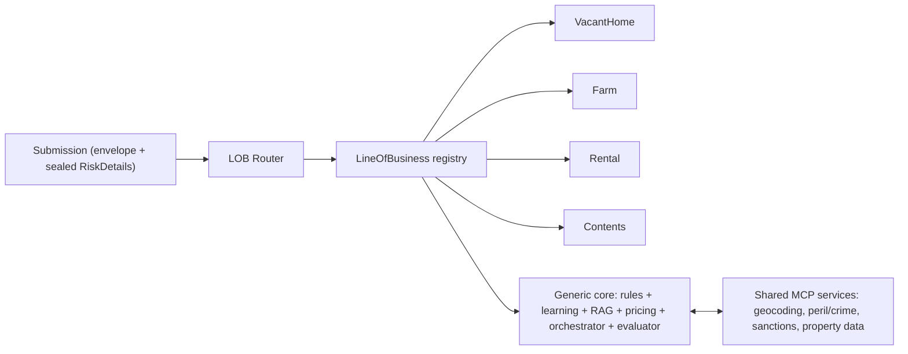

# 9. Multi-Line Architecture — A Line-of-Business Plug-in Model

**Project:** AI Underwriter Agent
**Document status:** Recommended design
**Audience:** Engineers, architects, product, underwriting
**Related:** [Recommended Solution](08-recommended-solution.md), [HLD](02-architecture-design.md), [Learning](05-ai-learning-design.md), [ADR-0009](adr/0009-line-of-business-plugin.md)

---

## 1. Goal

The agent is a generic, multi-line **property & casualty (P&C) underwriter** by design — vacant
home, farm, rental / landlord, contents / personal belongings, and future lines all run on one
shared core. **Vacant home (Canadian vacant-property) is the first line built and the worked
reference example** — it is one module among several, not the product's identity. This document
specifies the line-of-business plug-in model that lets a new line be added without a rewrite per
line, and without losing the determinism, learning, and auditability we have.

## 2. The principle: generic core + pluggable LOB modules ("product factory")

The agent core is **line-of-business agnostic**. Everything line-specific is packaged in a
**`LineOfBusiness` module** that plugs into a registry. Adding a new line = adding a module, not
editing the core.



> Standalone source: [`diagrams/lob-architecture.mermaid`](diagrams/lob-architecture.mermaid).

## 3. What's generic vs per-LOB

| Concern | Generic core (shared) | Per-LOB module |
|---------|----------------------|----------------|
| Submission shape | Common envelope (reference, applicant, location, coverage, **lineOfBusiness**) | `RiskDetails` variant (the line's risk fields) |
| Rules | Cross-LOB rules (completeness, location/remoteness, sanctions, prior-loss) | LOB-specific rules incl. its **knockouts** |
| Learning | `SimilarityEngine`, scoring, blending — unchanged | Feature schema + weights; book **partitioned by LOB** |
| RAG | Retriever, ingestion, citing — unchanged | Knowledge sources (its wordings/guidelines) tagged `lob` |
| Pricing | Orchestration, floors, area load | LOB `Rater` (base rates, rating factors) |
| Decisioning | Orchestrator, guardrail/learned/RAG blend, evaluator, audit | — |
| Enrichment | Geocoding, peril/crime, flood/wildfire, property data, AML (MCP) — serve **all** lines | Which enrichments are relevant |
| Routing | Detect the line, dispatch to its module | Declares how it's recognized |

## 4. The LOB module contract (SPI)

A `LineOfBusiness` is a Spring `@Component` bundling everything the core needs for that line:

```java
public interface LineOfBusiness {
    String id();                              // "VACANT_HOME", "FARM", "RENTAL", "CONTENTS"
    Class<? extends RiskDetails> detailsType();
    List<String> requiredFields(Submission s);          // completeness, per line
    FeatureExtractor featureExtractor();      // RiskDetails -> generic numeric/categorical vector + weights
    List<Rule> rules();                       // LOB-specific guardrails (incl. knockouts)
    List<KnowledgeDocument> knowledgeSources();// wordings/guidelines for RAG (tagged lob=id)
    Rater rater();                            // pricing for this line
}
```

Supporting types:

- **`RiskDetails`** — a `sealed interface` with one record per line (`VacantHomeDetails`,
  `FarmDetails`, `RentalDetails`, `ContentsDetails`). Type-safe, pattern-matchable, and forces
  every line to be explicit about its risk fields.
- **`FeatureExtractor`** — maps a line's `RiskDetails` to the generic feature vector the existing
  `SimilarityEngine` already consumes (this is today's `PolicyFeatures`, generalized). The
  learning core never learns line-specific code.
- **`Rater`** — `price(Submission, LearnedAssessment, enrichment) -> Money`.

The core injects `List<LineOfBusiness>` (Spring discovers all modules), builds a registry keyed by
`id()`, and dispatches per submission. **This is the same auto-discovery pattern we already use for
`Rule` and `UnderwritingAgent`** — so the architecture extends naturally.

## 5. How today's pieces generalize

- **`Submission`** gains `lineOfBusiness` + a `RiskDetails details` field; the vacant-home fields
  move into `VacantHomeDetails`. Common fields (applicant, location, coverage) stay on the envelope.
- **`RulesEngine`** runs shared rules + `lob.rules()`. The 72-hour inspection knockout becomes a
  **VacantHome** rule; each line brings its own knockouts.
- **Historical book** carries a `lineOfBusiness` tag; `SimilarityEngine` retrieves comparables
  **only within the same line** (and the synthetic generator produces a book per line).
- **RAG corpus** documents are tagged `lob`; retrieval filters by line.
- **Pricing** delegates to `lob.rater()`; the area/peril loads stay shared.
- **Routing** adds LOB detection (explicit field, or inferred by the intake/extraction agent).
- **Everything else** — orchestrator, decision policy, evaluator, audit, guardrails, MCP
  enrichment — is unchanged and shared.

## 6. The lines (risk drivers & example knockouts)

| Line | Key risk fields | Dominant perils | Example knockout / referral |
|------|-----------------|-----------------|-----------------------------|
| **Vacant home** (built) | vacancy duration, inspection cadence, security, water shutoff, roof, remoteness | theft, water, vandalism, fire | inspection > 72h (PR0003 / Supervisory Warranty) |
| **Farm** | barns/outbuildings, livestock, machinery, heat/electrical source, hay/manure storage, acreage, distance to fire response | fire, weather/hail, liability, equipment breakdown, livestock | uncertified woodstove/solid-fuel heat; no liability where required |
| **Rental / landlord** | tenancy type (long-term vs short-term/STR), units, tenant screening, loss-of-rent, occupancy gaps | liability, tenant damage, water, fire, loss of rent | short-term rental without an STR endorsement; missing required liability limit |
| **Contents / personal belongings** | total contents value, high-value scheduled items (jewellery/art/electronics), away-from-home cover, building security, replacement vs ACV | theft, fire, water, accidental damage | high-value items unscheduled above sub-limit; no security in high-theft area |

Cross-line, the **shared enrichment** (geocoding + flood/wildfire/wind/**crime** scores, property
data, sanctions/AML) feeds every line — the area-theft signal you wanted applies to vacant homes,
rentals and contents alike.

## 7. Shared services do the heavy lifting once

Because location risk, peril/crime scoring, sanctions and property data are common to all lines,
they live in the generic core (via MCP tools) and are written once. A new line inherits all of it
for free and only declares its own risk fields, rules, knowledge and rating.

## 8. Migration plan (no rewrite)

1. **Extract the abstraction** — introduce `LineOfBusiness`, `RiskDetails` (sealed),
   `FeatureExtractor`, `Rater`, and the registry/router in the core. Move generic rules out of the
   vacant-home set.
2. **Refactor vacant home into module #1** — `VacantHomeDetails` + its rules (incl. the 72h
   knockout) + its rater + its wordings. Behaviour identical to today; tests stay green.
3. **Add lines as modules** — Rental → Contents → Farm (recommended order, §9), each with a
   synthetic book partition and knowledge set.
4. **LOB-aware everything** — book partitioning, RAG `lob` filter, routing/detection, and per-line
   eval golden-sets.

Each step is independently shippable; the core is touched once (step 1), then never again to add a
line.

## 9. Rollout order & status

1. **Vacant home** — ✅ built; the reference line.
2. **Rental / landlord** — ✅ built: a `Submission.Rental` section, rental facts in `FactExtractor`,
   rules in `rules/rental.yml` (STR-without-endorsement knockout, liability-limit
   checks, tenant-screening, short-term-rental factor), and **line-isolated learning** — the
   `SimilarityEngine` only draws same-line comparables, so a rental (no rental history yet) is
   cold-start and the deterministic rules decide.
3. **Contents / personal belongings** — ✅ built: a `Submission.Contents` section (may have no
   building), contents facts, and `rules/contents.yml` (high-value-items-unscheduled, contents
   security, ACV basis, missing contents value). Property-only shared rules (`missing-building`,
   coverage-per-sqft) are excluded from contents via the rule `lines:` restriction.
4. **Farm** — richest/most complex (multiple structures, livestock, equipment); last.

Note this confirmed the design's promise: adding rental was **mostly config** (YAML rules) plus a
small typed `Rental` record and its facts — no engine/orchestrator rewrite. (Adjustable to business
priority — the architecture is order-independent.)

## 10. Risks & mitigations

| Risk | Mitigation |
|------|------------|
| Over-generalizing the core | Keep the envelope minimal; push specifics into modules; sealed `RiskDetails` keeps it explicit and type-safe. |
| Sparse history for new lines | Cold-start fallback (rules + base rate) already exists; synthetic book per line until real data arrives. |
| Cross-line leakage in learning | Retrieve comparables strictly within the same `lineOfBusiness`. |
| Inconsistent rules across lines | Shared rules in the core; only line-specific logic in modules; per-line eval golden-sets. |
| Extraction must detect the line | LOB on the submission, or inferred by the intake agent with a low-confidence → refer fallback. |
| Rating complexity per line | `Rater` SPI isolates it; start with transparent reference raters, refine per line. |
