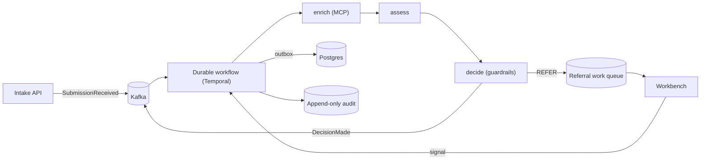

# 10. Runtime, Audit & Observability Architecture

**Project:** AI Underwriter Agent
**Document status:** Recommended design (the operational backbone)
**Audience:** Engineering, SRE, compliance, underwriting leadership
**Related:** [Recommended Solution](08-recommended-solution.md), [Target Architecture](07-target-architecture.md), [ADR-0010](adr/0010-event-driven-runtime.md)

---

## 1. Honest assessment of the design so far

The design through doc 9 is **correct as a reference core** — a clean decision model
(guardrails + k-NN + RAG advisory), modular lines, good seams. But it was scoped as a
**synchronous, in-memory** core, and that leaves three production-critical gaps (the ones raised
in review, plus what a full review adds):

| Gap | Why it matters | Status before this doc |
|-----|----------------|------------------------|
| **No queue / async pattern** | Enrichment (external APIs) + LLM calls + HITL are slow and bursty; a synchronous request can't wait minutes, survive spikes, retry, or pause for a human. | Missing |
| **No durable audit logging** | The audit trail is in-memory and returned in the response — not persisted, centralized, queryable, or tamper-evident. Useless for a regulator after the fact. | In-memory only |
| **No metrics / dashboard** | No way to measure throughput, STP rate, decision mix, latency, LLM cost, override rate, or predicted-vs-realized loss. Can't run or improve the operation. | Missing |
| No persistence | Nothing stored → no replay, no flywheel, no history. | Missing |
| No retries / DLQ / idempotency | External calls fail; without these, work is lost or double-processed. | Missing |
| No durable submission state machine | HITL and long-running steps need durable state, not a stack frame. | Missing |

**Verdict: yes, we can do better — and these are foundational, not Phase 6 polish.** Persistence,
eventing, audit and observability are prerequisites for safe autonomy/STP and the data flywheel,
so they move *earlier* in the roadmap (§7).

## 2. Event-driven runtime (the queue pattern)

Move from "one synchronous request does everything" to a **hybrid**:

- **Sync fast-path** — for instant quotes and STP-eligible simple cases that finish in well under a
  second (rules + k-NN, no external calls). Low latency where it's achievable.
- **Async event-driven pipeline** — for anything involving enrichment, LLM reasoning/drafting, or
  human review. The submission is accepted (`202 Accepted` + id), published as an event, and
  processed by a durable workflow; the client polls or gets a webhook/event on completion.

> Standalone source: [`diagrams/runtime-architecture.mermaid`](diagrams/runtime-architecture.mermaid).

**Patterns applied**

- **Durable workflow orchestration** (Temporal) for the per-submission lifecycle: built-in
  **retries, timeouts, and "wait for human signal"** — HITL referrals pause the workflow durably
  until an underwriter acts, then resume. This replaces hand-rolled sagas and is the cleanest way
  to do long-running + human-in-the-loop.
- **Event log / backbone** (Kafka): `SubmissionReceived`, `DecisionMade`, `OutcomeRecorded` topics.
  An immutable, **replayable** log — which doubles as the audit source and feeds the flywheel.
- **Outbox pattern** — DB write + event publish atomically (no lost/contradictory events).
- **Idempotency** — every command carries a key; consumers dedupe (safe retries, exactly-once
  effect).
- **Retries + backoff + dead-letter queue** — transient failures retry; poison messages land in a
  DLQ for inspection, never block the pipeline.
- **Durable submission state machine** — explicit lifecycle persisted in Postgres:
  `RECEIVED → ENRICHING → ASSESSED → (AUTO_DECIDED | REFERRED → DECIDED) → BOUND/CLOSED`.
- **Backpressure / spike handling** — the broker absorbs bursts; workers scale horizontally.
- **Replay / reprocessing** — re-run historical submissions when rules/models change, for
  back-testing and regression — a direct benefit of the event log.

## 3. Durable audit & decision lineage

Separate three concerns that were conflated:

| Concern | What | Where |
|---------|------|-------|
| **Operational logs** | Technical, structured JSON logs (debug/ops) | Loki / ELK / CloudWatch, via SLF4J JSON encoder |
| **Decision audit trail** | Every agent step, tool call, retrieved source, prompt/version, model id, score, human override, with timestamps and actor | Append-only Postgres table + `audit` Kafka topic |
| **Decision lineage** | The full reconstruction of *why* a decision happened: inputs → enrichment → comparables → RAG sources → rule findings → outcome → reviewer | Linked records keyed by decision id |

Design points:

- **Correlation/trace id** stamped at intake and carried through every event, log, and span
  (OpenTelemetry) — one id ties the whole story together across async hops.
- **Append-only + tamper-evident** — audit rows are immutable; optional **hash-chaining** (each
  row references the prior row's hash) makes tampering detectable — important for regulatory trust.
- **Versioning** — prompt versions, rule-set versions, model ids, and threshold versions are
  recorded with each decision, so a decision is reproducible against the exact logic that produced
  it.
- **Retention & access** — configurable retention; read API/UI for compliance to retrieve any
  decision's full lineage on demand.
- The existing in-memory `AuditTrail` becomes the *source* of these events; we persist and stream
  it instead of only returning it.

## 4. Metrics, monitoring & dashboards

Instrument with **Micrometer → Prometheus**, trace with **OpenTelemetry**, visualize in
**Grafana**, plus an **embedded underwriting performance dashboard** for the business.

**Technical / SRE metrics**
- Throughput (submissions/min), end-to-end and per-stage latency (p50/p95/p99)
- Queue depth, consumer lag, retry counts, DLQ size
- Error rates per stage/tool, external-tool latency/availability
- **LLM cost & tokens per decision**, embedding/model latency, cache hit rate

**Business / underwriting metrics**
- Submissions by line of business; decision mix (approve/refer/decline); **STP (auto) rate**
- Referral reasons distribution; time-to-decision (auto vs assisted)
- Premium quoted/bound; declination rate; appetite breaches

**Model / quality metrics (the flywheel)**
- Override rate (how often underwriters change the recommendation) and override reasons
- Decision-agreement vs senior underwriters on a golden set
- RAG groundedness / faithfulness (LLM-as-judge); retrieval precision
- **Predicted vs realized loss ratio** as outcomes mature — the ultimate accuracy signal

**Alerting** — queue lag, DLQ growth, error-rate and latency SLOs, cost spikes, drift in decision
mix or override rate.

## 5. Recommended stack

| Capability | Recommended | Lean-start alternative |
|------------|-------------|------------------------|
| Event backbone / log | **Kafka** (replayable, audit + flywheel) | RabbitMQ (simpler work-queue) |
| Workflow + HITL | **Temporal** (durable retries/timers/signals) | Spring StateMachine + DB + `@Async` |
| Persistence | **Postgres** (state, decisions, outcomes, audit) **with the `pgvector` extension** (serves the RAG vector store too) | Postgres + pgvector |
| Audit stream | Append-only Postgres + Kafka `audit` topic (+ hash chain) | Append-only Postgres table |
| Metrics | **Micrometer + Prometheus** | Actuator + Prometheus |
| Tracing | **OpenTelemetry** | OTel (Spring starter) |
| Dashboards | **Grafana** (ops) + embedded UW performance dashboard | Grafana only |
| Logs | Structured JSON → **Loki/ELK** | JSON logs to stdout |

This is all standard, well-supported Spring Boot territory (Spring Kafka, Spring for Temporal/
community SDK, Actuator/Micrometer, OTel). Start lean (Postgres + Actuator/Prometheus + a state
column + `@Async`) and graduate to Kafka + Temporal as volume and autonomy grow — the seams don't
change.

## 6. How this strengthens the rest of the design

- **Autonomy/STP** becomes safe to widen because every auto-decision is durably audited, measured,
  and replayable, with override and loss-ratio feedback visible.
- **The data flywheel** is now real: `OutcomeRecorded` events feed the book, RAG corpus and eval
  sets.
- **HITL** is first-class: referrals are durable work items the workflow waits on, not lost
  in-flight requests.
- **RAG/LLM resilience** improves: slow/failing model and tool calls retry and degrade without
  failing the submission.

## 7. Roadmap impact (re-sequenced)

Persistence + eventing + audit + observability move **earlier** — they're foundational:

| Phase | Scope |
|-------|-------|
| 0 | Decision core ✅ |
| **1** | **Persistence + durable audit + basic metrics** (Postgres, append-only audit, Actuator/Micrometer) — *new, foundational* |
| 2 | RAG grounding |
| **3** | **Event-driven runtime + durable workflow + async HITL** (broker, Temporal, retries/DLQ/outbox, state machine) |
| 4 | MCP enrichment |
| 5 | Multimodal intake + drafting |
| 6 | Evaluator + autonomy tiers (now safely measurable) |
| 7 | **Dashboards + AI-ops + data flywheel** (Grafana, UW performance dashboard, drift, golden-set evals) |
| 8 | Production hardening (scale, authz, model routing, HA/DR) |

## 8. Risks & mitigations

| Risk | Mitigation |
|------|------------|
| Over-engineering for current volume | Lean-start tier (Postgres + Actuator + state column) before Kafka/Temporal; adopt on real need. |
| Async complexity / eventual consistency | Durable workflow (Temporal) hides most of it; explicit state machine; idempotency + outbox. |
| Audit store tampering | Append-only + hash-chaining + restricted access + retention policy. |
| Metric/dashboard sprawl | Curated KPI set (§4) tied to decisions people actually make; SLOs + alerts only on those. |
| Cost blow-up (LLM/tools) | Cost metrics + budgets/alerts; sync fast-path avoids LLM where not needed; caching. |
| PII in logs/audit | PII-aware structured logging + redaction at the guardrail layer; access controls on audit. |
