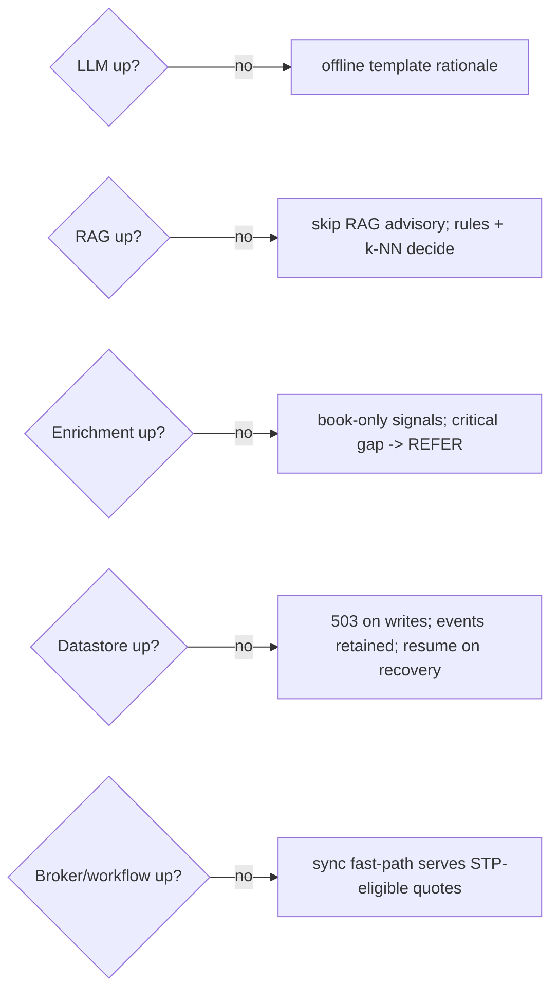

# 12. Resilience & Disaster Recovery

**Project:** AI Underwriter Agent
**Document status:** Recommended design
**Audience:** Engineering, SRE, business continuity
**Related:** [Runtime/Audit](10-runtime-audit-observability.md), [Security](11-security-privacy.md), [ADR-0012](adr/0012-resilience-dr.md)

---

## 1. Principle

The agent depends on things that *will* fail — external LLMs, enrichment APIs, the broker, the
database. The design rule: **degrade to a safe floor, never fail the submission, and never
silently lose work.** Because AI is layered (offline floor → k-NN → RAG → cloud LLM/enrichment),
losing an upper layer reduces capability, not availability.

## 2. Targets (starting SLOs — tune with the business)

| Metric | Target |
|--------|--------|
| Service availability | 99.9% (core decision path) |
| **RTO** (recovery time) | ≤ 1 hour (region failure), ≤ 5 min (AZ failure) |
| **RPO** (data loss) | ≤ 5 min (decisions/audit); 0 for committed audit via the event log |
| Sync fast-path latency | p95 < 1 s |
| Async decision (no HITL) | p95 < 2 min |

## 3. Graceful degradation matrix

> Standalone source: [`diagrams/degradation-matrix.mermaid`](diagrams/degradation-matrix.mermaid).

| Dependency down | Behaviour | Impact |
|-----------------|-----------|--------|
| Cloud **LLM** | Offline template reasoner writes the rationale | Decision unchanged; rationale less rich |
| **RAG / vector store (pgvector)** | Skip the RAG advisory finding | Rules + k-NN still decide; no citations |
| **MCP enrichment** | Use book-only signals; **refer** if a decision-critical field is missing | Slightly less accurate or a referral |
| **Datastore** | Reject new writes (503); event log retains; in-flight workflows resume | Pause, not loss |
| **Broker / workflow engine** | Sync fast-path keeps serving simple STP quotes | Heavy async path paused |
| Multiple/total | Deterministic floor (rules + k-NN) is always available | Reduced capability, still safe |

The **deterministic floor (rules guardrails + k-NN) has no external dependency** — it's the
always-on core.

## 4. Redundancy & high availability

- **Stateless app** — horizontally scaled across **≥2 AZs** behind a load balancer; rolling
  deploys.
- **Datastore** — primary + standby replica with automatic failover; PITR enabled.
- **Event broker / workflow** — replicated/clustered across AZs.
- **Vector store (pgvector)** — lives in the Postgres above, so it inherits the same
  replica/failover/PITR; additionally **rebuildable from source** (re-ingest the corpus), so it's
  recoverable even without a backup.
- **External AI/enrichment** — the offline floor *is* the redundancy; optionally a secondary
  provider behind the same seam.

## 5. Backups & recovery

| Asset | Strategy |
|-------|----------|
| Decisions / submissions / outcomes (Postgres) | Automated backups + **PITR**; cross-region copies (Canadian regions) |
| **Audit log** | Append-only + replicated + backed up; the Kafka event log is itself a durable, replayable record (RPO ≈ 0 for committed events) |
| Vector store (pgvector) | Covered by the Postgres backups/PITR; also rebuildable by re-ingestion |
| Config / rules / thresholds / prompts | Versioned in source control + backed up (also the governance record, [doc 13](13-ai-governance-model-risk.md)) |
| Secrets | Managed by the secrets manager with its own backup/rotation |

**Backups are tested** — periodic restore drills; a backup that's never restored isn't a backup.

## 6. Resilience patterns (in the app)

- **Timeouts** on every external call (LLM, MCP tools, DB).
- **Circuit breakers + bulkheads** (Resilience4j) so a slow/failing dependency can't exhaust
  threads or cascade.
- **Retries with backoff + jitter** for transient faults; **dead-letter queue** for poison
  messages (from [doc 10](10-runtime-audit-observability.md)).
- **Fallbacks** wired to the degradation matrix above.
- **Idempotency + the durable workflow** mean a recovered node resumes exactly where it stopped —
  no double decisions, no lost referrals.
- **Health checks** (liveness/readiness) drive load-balancer and orchestrator decisions.

## 7. Disaster recovery

- **Multi-AZ active** by default (AZ loss ≈ seconds-to-minutes, automatic).
- **Cross-region warm standby** (Canadian region, for residency) for region loss: replicated data
  + event log, infrastructure-as-code to stand up, documented **failover & failback runbooks**.
- **DR drills / game days** on a schedule; chaos testing (kill a dependency, verify the
  degradation path) to prove the floor holds.

## 8. Risks & mitigations

| Risk | Mitigation |
|------|------------|
| External AI outage stalls underwriting | Offline floor keeps deciding; capability, not availability, degrades |
| Silent data loss on failure | Event log + outbox + PITR + tested restores; RPO targets enforced |
| Cascading failure from one slow dependency | Circuit breakers, bulkheads, timeouts |
| DR plan that only exists on paper | Scheduled drills + chaos game-days |
| Residency breach in DR region | DR pinned to Canadian regions; verified in runbooks |
| Degraded mode goes unnoticed | Alerts when any layer is in fallback; dashboard shows current capability level |
