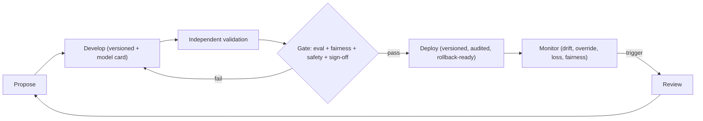

# 13. AI Governance & Model Risk Management

**Project:** AI Underwriter Agent
**Document status:** Recommended design
**Audience:** Model risk, compliance, underwriting leadership, engineering, data
**Related:** [Target Architecture](07-target-architecture.md), [Runtime/Audit](10-runtime-audit-observability.md), [Security](11-security-privacy.md), [ADR-0013](adr/0013-ai-governance-model-risk.md)

> Not legal advice. Align specifics with your model-risk policy, OSFI expectations, and provincial
> insurance/privacy regulators.

---

> **Data prerequisite:** the fairness/disparate-impact testing, performance validation, and
> predicted-vs-realized loss monitoring described here require **real, labelled outcome data with
> group attributes**. They are **not meaningfully testable on the current synthetic book** — treat
> this document as the governance framework to apply once real data is available (the synthetic
> book exercises the mechanics only). See [doc 5 §7](05-ai-learning-design.md).

## 1. Why this matters here

Every piece of decision logic — the rules and thresholds, the k-NN config, the embedding model,
the LLM, and the prompts — is, in regulatory terms, a **model**. For an insurer making automated
decisions about people, unmanaged models create two serious exposures: **unfair outcomes**
(especially proxy discrimination) and **un-auditable changes**. This document makes model risk an
explicit, governed lifecycle.

## 2. Inventory: what's governed

| Asset | Examples | Owner |
|-------|----------|-------|
| Rules & thresholds | Knockouts, `REFER_THRESHOLD`, learned bands, authority limits | UW + Eng |
| Learning config | k-NN feature weights, k, book partitions | Data + UW |
| Models | Embedding model, LLM (provider/version), the **GBM** claim-prob/loss-ratio model ([ADR-0020](adr/0020-hybrid-predictive-model.md)) | Data/ML |
| Prompts | Reasoner prompt, **reviewer/evaluator prompt** ([ADR-0022](adr/0022-reviewer-agent.md)), **semantic-extraction prompt + feature schema** ([ADR-0021](adr/0021-semantic-feature-extraction.md)) — all versioned | Eng + UW |
| Rating | Per-LOB raters | Actuarial/UW |

Each has a **model card**: purpose, inputs/data, method, performance, **known limitations**,
fairness considerations, owner, and version history.

## 3. The change-management gate (no quiet changes)

Nothing in §2 ships without passing a gate — this is the single most important governance control.

> Standalone source: [`diagrams/model-governance-lifecycle.mermaid`](diagrams/model-governance-lifecycle.mermaid).

The gate requires **all** of:

1. **Eval harness vs the golden set** — no regression on decision quality/agreement ([doc 10](10-runtime-audit-observability.md)).
2. **Fairness / bias test** — no disparate impact or prohibited proxy (see §4).
3. **Groundedness & safety** — LLM-as-judge faithfulness for any AI-authored text.
4. **Sign-off** — a **segregated approver** (author ≠ approver) and, for material changes, a model-
   risk / underwriting committee.

Every change is **versioned and audited**, and the deployed version id is recorded on each decision
([doc 10](10-runtime-audit-observability.md) lineage), so any decision is reproducible against the exact
logic that made it, and any change is **rollback-ready**.

## 4. Fairness & bias (the insurance trap)

The classic failure in personal/property lines is **proxy discrimination** — a feature that
correlates with a protected characteristic (the textbook case: **postal code as a proxy for
ethnicity/income → redlining**). Because we deliberately use location and area-loss signals, this
risk is real and must be tested, not assumed away.

Controls:

- **Feature review** — every feature (especially location/area signals) reviewed for proxy risk;
  prohibited and sensitive characteristics are never inputs.
- **Disparate-impact testing** — measure decision outcomes (approve/refer/decline rates, pricing)
  across groups on the eval set; flag and investigate material disparities before and after deploy.
- **Justification** — risk-relevant factors must be actuarially/causally defensible, not merely
  correlated; document the rationale per factor.
- **Continuous monitoring** — fairness metrics tracked in production, not just at release.
- **Recourse** — recommend-only + cited rationale + human review give applicants a basis for
  explanation and appeal.

## 5. Human oversight & accountability

- **Named owners** per model/asset; a **model-risk / AI governance committee** with periodic review
  cadence.
- **Independent validation** — whoever builds a change doesn't approve it (ties to segregation of
  duties in [doc 11](11-security-privacy.md)).
- **Human-in-the-loop** remains the decision authority; autonomy tiers are themselves a governed
  setting with QA sampling.

## 6. Monitoring, drift & triggered review

Production signals (from [doc 10](10-runtime-audit-observability.md)) that trigger a review or rollback:

- **Performance drift** — predicted vs **realized loss ratio** diverging as outcomes mature.
- **Decision drift** — shift in approve/refer/decline mix or STP rate beyond control limits.
- **Override drift** — rising underwriter override rate (the model and humans disagreeing more).
- **Data drift** — input distributions moving away from the book the logic was validated on.
- **Fairness drift** — group-level disparities emerging over time.
- **RAG/LLM quality** — groundedness scores dropping.

## 7. Transparency & documentation (regulator-ready)

- Model cards + validation reports + fairness assessments retained and versioned.
- Decision lineage on demand (inputs → evidence → logic version → outcome → reviewer).
- Clear statement that decisions are **AI-assisted, human-decided**, with explainable rationale —
  supporting automated-decision transparency expectations.

## 8. Lifecycle summary

`Propose → Develop (versioned + model card) → Independent validation → Approval gate (eval +
fairness + safety + sign-off) → Deploy (audited, rollback-ready) → Monitor (drift/fairness/loss) →
Review/Retire.`

## 9. Risks & mitigations

| Risk | Mitigation |
|------|------------|
| Proxy / disparate-impact discrimination | Feature proxy review, disparate-impact testing pre/post deploy, continuous fairness monitoring, factor justification |
| Silent or untracked logic changes | Mandatory gate, versioning, audited deploys, version id on every decision |
| Model/data drift unnoticed | Drift monitors + triggered review + realized-loss feedback |
| LLM hallucination influencing decisions | Groundedness gate, advisory-only AI, deterministic veto |
| "Black box" challenged by regulator | Model cards, lineage, cited rationale, recommend-only + human oversight |
| Author grades own homework | Independent validation + segregated sign-off + committee for material changes |
