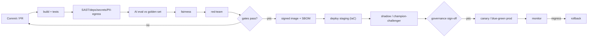

# 16. Deployment, DevOps & Environments

**Project:** AI Underwriter Agent
**Document status:** Recommended design
**Audience:** Engineering, SRE/platform, security, compliance
**Related:** [Runtime/Audit](10-runtime-audit-observability.md), [Resilience](12-resilience-dr.md), [Testing](15-testing-evaluation-quality.md), [ADR-0016](adr/0016-deployment-devops.md)

---

## 1. Principle

Ship small, safe, reversible changes through an **automated pipeline that enforces the quality,
fairness and security gates** — and run everything as **code** (infra, config, policy) in
**Canadian regions** for residency.

## 2. Packaging & runtime

- **Containerized** Spring Boot service (the existing jar), image built reproducibly with an
  **SBOM** and signed.
- **Kubernetes** (managed, Canadian region) for orchestration: horizontal autoscaling, rolling/
  blue-green deploys, liveness/readiness probes, multi-AZ ([doc 12](12-resilience-dr.md)).
- Stateful dependencies (Postgres, broker, workflow engine, vector store) as managed services or
  operators, also multi-AZ.

## 3. Environments

| Env | Purpose | Data |
|-----|---------|------|
| **Dev** | Fast iteration; offline AI floor by default | Synthetic |
| **Test/CI** | Automated tests + eval/fairness/red-team gates | Synthetic golden set |
| **Staging** | Prod-like; shadow / champion-challenger; perf & DR drills | Masked/synthetic |
| **Prod** | Live, Canadian region, full controls | Real (encrypted, governed) |

Config and secrets are **per-environment**, externalized (secrets manager, [doc 11](11-security-privacy.md)) —
never baked into images.

## 3. CI/CD pipeline

> Standalone source: [`diagrams/cicd-pipeline.mermaid`](diagrams/cicd-pipeline.mermaid).

Gates (from [doc 15](15-testing-evaluation-quality.md) and [doc 13](13-ai-governance-model-risk.md)): tests →
security scans → AI eval (no regression) → fairness → red-team → **governance sign-off for
rule/model/prompt changes** → canary with auto-rollback.

## 4. Release strategy

- **Blue-green / canary** deploys; health- and metric-gated promotion; **instant rollback**.
- **Decoupled config** — rules/thresholds/prompts/LOB modules are versioned artifacts promoted
  through the same gates (a threshold change is a governed release, not a hotfix).
- **Feature flags** — RAG, enrichment, autonomy tiers toggled per environment for safe, staged
  enablement.
- **DB migrations** — versioned (e.g. Flyway), backward-compatible, expand/contract for zero-downtime.

## 5. Infrastructure as code & GitOps

- All infra (clusters, datastores, broker, networking, IAM) defined as **IaC** (Terraform);
  cluster state via **GitOps**. Reproducible environments and DR stand-up ([doc 12](12-resilience-dr.md)).
- Policy-as-code (authZ policies, [doc 11](11-security-privacy.md)) versioned and deployed the same way.

## 6. Observability & ops hooks

Every deploy wires up metrics/traces/logs ([doc 10](10-runtime-audit-observability.md)): SLO dashboards,
the underwriting performance dashboard, drift/fairness/cost monitors, and alerting. Deploys are
annotated on dashboards for correlation.

## 7. Security in the pipeline

SAST + dependency/container scanning + secrets scanning + SBOM + signed images + PII-egress tests
are pipeline gates ([doc 11](11-security-privacy.md), [doc 15](15-testing-evaluation-quality.md)); least-privilege
deploy credentials; immutable, audited deploys.

## 8. Risks & mitigations

| Risk | Mitigation |
|------|------------|
| Bad change reaches prod | Layered gates + shadow + canary + auto-rollback |
| Config/threshold change slips ungoverned | Treat config as a governed, versioned release through the gates |
| Environment drift | IaC + GitOps; no manual prod changes |
| Residency violation | Canadian-region clusters/data enforced in IaC; checked in CI |
| Downtime on release | Blue-green/canary + backward-compatible migrations |
| Secret sprawl | Secrets manager + per-env injection + scanning |
