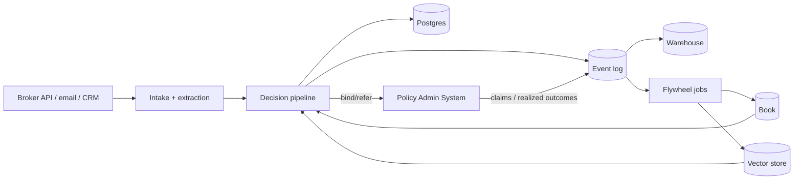

# 17. Data & Integration Architecture

**Project:** AI Underwriter Agent
**Document status:** Recommended design
**Audience:** Engineering, data, integration, underwriting
**Related:** [Runtime/Audit](10-runtime-audit-observability.md), [Learning](05-ai-learning-design.md), [Security](11-security-privacy.md), [ADR-0017](adr/0017-data-integration.md)

---

## 1. Principle

Treat data as a governed asset and integrations as versioned contracts. The system both **consumes**
(submissions, accounts, documents, enrichment) and **produces** (decisions, bindings, audit,
events), and it **closes the loop** by ingesting realized outcomes back into the learning core.

## 2. Data stores (each with a clear job)

| Store | Holds | Notes |
|-------|-------|-------|
| **OLTP (Postgres)** | Submissions, decisions, submission state, outcomes | System of record; encrypted, PII-classified ([doc 11](11-security-privacy.md)) |
| **Audit / lineage** | Append-only decision lineage | Immutable, hash-chained ([doc 10](10-runtime-audit-observability.md)) |
| **Vector store (`pgvector`)** | Knowledge embeddings (wordings, guidelines, precedent) | Runs in the shared Postgres (pgvector extension); de-identified; rebuildable from source ([doc 6](06-rag-design.md)) |
| **Historical book** | Past policies + outcomes for k-NN | Partitioned by line of business ([doc 9](09-multi-line-architecture.md)) |
| **Event log** | `SubmissionReceived`, `DecisionMade`, `OutcomeRecorded` | Backbone + replay + flywheel feed ([doc 10](10-runtime-audit-observability.md)) |
| **Analytics / warehouse** | Curated facts for dashboards & evals | Fed from the event log |

## 3. The flow (and the flywheel)

> Standalone source: [`diagrams/data-integration.mermaid`](diagrams/data-integration.mermaid).

The **flywheel** is the point: `OutcomeRecorded` events (claims, loss) flow back to refresh the
k-NN book, the RAG corpus/precedent, and the eval golden set — so the agent improves with
experience ([doc 5](05-ai-learning-design.md), [doc 13](13-ai-governance-model-risk.md)).

## 4. External integrations (contracts)

| System | Direction | Mechanism |
|--------|-----------|-----------|
| Broker portal / partner API | in: submissions; out: quotes/decisions | REST API + webhooks; OAuth2 ([doc 11](11-security-privacy.md)) |
| Email / document intake | in: documents | Ingestion + multimodal extraction; treated as untrusted ([doc 11](11-security-privacy.md)) |
| CRM | in: accounts; out: notifications | API / events |
| **Policy Admin System (PAS)** | out: bind/issue; in: claims/outcomes | API + events; binding stays human-gated |
| Document store | out/in: documents | API |
| Enrichment providers | out: lookups | **MCP tools**, scoped, validated, cached ([doc 7](07-target-architecture.md), [doc 14](14-cost-governance.md)) |
| Identity provider | authN/authZ | OIDC ([doc 11](11-security-privacy.md)) |

Integration principles: **versioned API/event contracts** with consumer-driven contract tests
([doc 15](15-testing-evaluation-quality.md)); the **outbox pattern** so DB writes and emitted events stay
consistent ([doc 10](10-runtime-audit-observability.md)); idempotent consumers; an **anti-corruption layer**
(adapters) so external schemas don't leak into the core domain.

## 5. Data quality, lineage & governance

- **Data quality** at intake — validation, completeness, plausibility/contradiction checks (already
  in the rules core) gate entry; bad data → `REFER`, never silently used.
- **Lineage** — every decision links its inputs, enrichment, retrieved sources, logic version, and
  outcome ([doc 10](10-runtime-audit-observability.md)).
- **Master/reference data** — canonical references (cities/regions/peril tables, LOB definitions)
  managed and versioned; a golden record for accounts where feasible.
- **Classification & retention** — per [doc 11](11-security-privacy.md) (PII handling, retention,
  crypto-shredding); analytics uses de-identified data where possible.
- **Schema evolution** — backward-compatible migrations ([doc 16](16-deployment-devops.md)); event schemas
  versioned.

## 6. Multi-line & multi-jurisdiction data

The book and knowledge corpus are **partitioned by line of business**; reference/regulatory data
can vary **by province** — modeled as reference data so the same engine serves multiple
jurisdictions without code forks ([doc 9](09-multi-line-architecture.md)).

## 7. Risks & mitigations

| Risk | Mitigation |
|------|------------|
| Garbage-in submissions | Intake validation + contradiction rules → refer; data-quality metrics |
| External schema changes break us | Anti-corruption adapters + consumer-driven contract tests + versioned contracts |
| Lost/duplicated events | Outbox + idempotency + replayable log |
| Outcome data slow/missing (flywheel starves) | Works on current book meanwhile; ingest outcomes as they mature; monitor coverage |
| PII in analytics/warehouse | De-identify on the way out; access controls; classification |
| Cross-line/jurisdiction leakage | Partitioned book/corpus; reference data per province; retrieval filtered by LOB |
